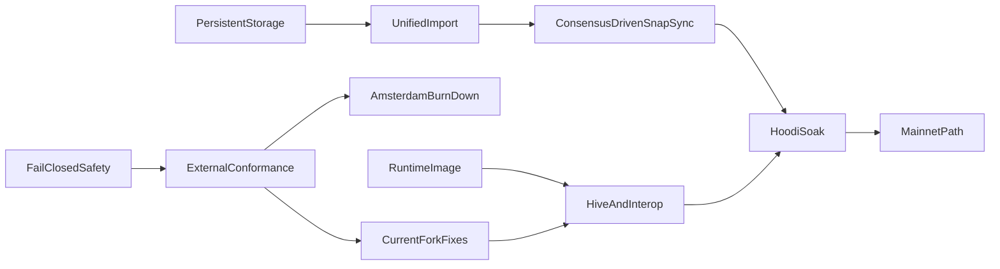

# Public-Testnet Readiness and Mainnet Path

## Audit conclusion

At `578cb476`, the project had broad in-tree implementations and a green CI run,
but was not public-testnet-ready. The current tree has since replaced the
memory-mirrored production store and implemented the unified import boundary in
Sections 3 and 4. Those changes remove two critical findings from the baseline;
they do not make the client public-testnet-ready.

Remaining release-blocking gaps include:

- **Consensus evidence:** fixture and non-blocking Hive coverage is not yet a
  blocking, zero-unexpected-skip gate over the active Osaka/BPO2 surface, and
  there is no live EL/CL interop gate.
- **Current-fork execution:** Amsterdam is now gated unavailable instead of
  being advertised incorrectly, but EIP-2780/EIP-7778/EIP-7976/EIP-7981,
  complete EIP-8246 behavior, and current EIP-8037/EIP-8038 system-call
  accounting still have to land and pass external conformance.
- **No practical bootstrap:** public presets supply genesis but no bootnodes;
  the live Hello advertises only `eth`; snap and multi-peer implementations have
  no production caller.
- **Resource work beyond import caches:** pooled blob transaction and sidecar
  admission is not one atomic ownership/refcount transition, and payload
  construction still repeatedly re-executes prefixes instead of using bounded
  incremental checkpoints.
- **Runtime and release integration:** public RPC and Engine scheduling,
  WebSocket work budgets, a reproducible hardened runtime artifact, operational
  metrics, and live/soak evidence remain release work.
- **Mainnet path:** cumulative total difficulty and the verified real Merge
  selection path remain incomplete; normal mainnet bootstrap, historical
  differential checks, and a separate soak are still required.

Resolved findings relevant to this dependency chain:

- **Production storage:** public-network datadirs select the schema-v4 direct
  RocksDB provider, which point-reads retained chain/state data and commits dirty
  trie paths rather than hydrating and copying a complete memory store.
- **Import authority and recovery:** Engine, P2P, staged, prepared-build, and
  dev-period paths now cross the common block-import service. P2P keeps the
  eth-wire block typed so execution-derived Prague requests and Amsterdam block
  access lists are not erased by an incomplete Engine round-trip, and executes
  only hash-addressed candidates. Outside explicit local `--dev` mode, Engine
  forkchoice owns post-Merge canonical, safe, and finalized publication.
  Persistent peer cursors share the candidate KV batch used for restart
  recovery.
- **Import-side cache bounds:** remote blocks, forkchoice targets, invalid
  blocks, prepared payloads, and blob sidecars now have deterministic
  count/encoded-byte/process-local-age policies plus finality pruning where a
  block number is known. Atomic pooled-blob admission and incremental proposal
  construction stay in Section 6.

Keep the substantial completed work: bounded HTTP/RLP framing, typed
transactions and receipts, txpool limits, KZG/BLS fail-closed behavior,
journaled EVM revert, Engine/public RPC breadth, persistent MPT node primitives,
and in-tree fork tests. Rework only where the live path or external evidence is
missing.

## Pinned verification baseline

- Current stable execution fixtures: `tests@v20.0.1`, commit
  `87aba1a38a476b31f819a2390eb481527e6dc683`, asset SHA-256
  `3586193db06d4d5745d5e90b3c3008c2255a4e19ccd8f11a3ce887aec8c0b17c`.
- Amsterdam feature fixtures: `tests-glamsterdam-devnet@v7.2.1`, commit
  `882909a2c88751a31fa99a65176563a16c527893`, asset SHA-256
  `02e3eca2ede5b424f4dbf2461caf592e6b43b56d55bbd64213dd01f63af9a583`.
- Hive: `dde4f59d04ff0ff8b6585670b08cea1b6c8ab65c`; Execution APIs:
  `e5d1bb60e6c064e4b15080da07b4370d0baadf92`; devp2p specs:
  `51dc101fddd52b5d90e59a2d695a92e4d600cfaf`.
- Preserve the existing pinned geth `38271784...` and Nethermind `e52dc19a...`
  comparisons until deliberately upgraded.

## Dependency order

## Implementation plan

### 1. Restore honest, safe boundaries first

- Set Amsterdam execution unavailable in `src/runtime/evm/base.lisp`; keep
  Engine V5/V6/V4 forkchoice absent until the Amsterdam gate below passes. Split
  KZG point/blob verification from cell-computation capability so
  `engine_getBlobsV4` is advertised only when callable.
- Fix IP-literal vhost handling in `src/transport/http/policy.lisp`.
- Change every thread boundary, including the first two workers in
  `src/app/cli/devnet/background.lisp`, to contain `serious-condition`.
- Create JWT and node-key files atomically with `O_EXCL|O_NOFOLLOW`, mode
  `0600`, and OS CSPRNG only in `src/app/cli/devnet/files.lisp`; require JWT
  when Engine binds non-loopback.
- Reject unknown TOML keys and stop accepting critical no-op flags
  (`--syncmode`, `--db.engine`, `--nodiscover`, discovery/NAT modes) unless
  their behavior is implemented.
- Reconcile the existing uncommitted `README.md` and `docs/validation.md` edits;
  qualify adapter-only RocksDB/snap/discv5/PoW claims. Correct
  `docs/storage-substrate.md`, `docs/architecture.md`, and
  `docs/reference-map.md`.

### 2. Make external conformance non-vacuous

- Add checksum-pinned fetchers for both fixture baselines and update
  `PROJECT.md` only after the new stable corpus is green.
- Generalize `tests/fixture-runner-state-selectors.lisp`,
  `tests/fixture-runner-blockchain-selectors.lisp`, and materializers to execute
  Cancun, Prague, Osaka/BPO2, valid and invalid Engine payload versions,
  transitions, blobs, requests, receipts, and standard RLP blocks.
- Emit and assert selected/executed/skipped counts per fork, family, format, and
  validity. Reject zero aggregate selection before e2e workers are sharded.
- Add a runtime client image and pinned Hive adapter; gate Engine/auth, EELS
  consume-engine/consume-rlp, `rpc-compat`, devp2p, full-sync, and snap suites in
  CI. Add live geth/Nethermind and Lighthouse interop smoke gates.
- Keep documentation transcripts in CI and archive versioned conformance
  reports.

### 3. Replace the memory-mirrored production store

- Introduce a production chain/state provider backed directly by
  `src/foundation/database/rocksdb.lisp`; make public-network datadirs select it
  while retaining memory/file stores as test oracles.
- Replace `chain-store-atomic-commit` in
  `src/storage/node-store/snapshots.lisp` whole-store copies with a changed-key
  journal and one RocksDB write batch covering block, state/trie/code, receipts,
  indexes, sidecars, txpool effects, and checkpoints.
- Make state execution start from the persisted account-trie root, lazily
  resolve hash nodes and storage tries, preserve the trie between blocks, and
  persist only newly allocated dirty paths. Commit touched accounts/slots rather
  than calling full-state iteration in `src/application/services/execution.lisp`.
- Add hash-addressed bytecode, schema-version reads, unknown-version refusal,
  resumable forward migration, finality-aware retention, backup/restore,
  verify/repair/rebuild commands, RocksDB iterator error/range fixes, and
  crash-injection tests.
- Prove per-block and rollback work depends on touched state, not retained
  history or total accounts; prove a dataset larger than RAM opens with bounded
  RSS and restart time.

### 4. Build one validated, durable import service

- Engine, P2P, staged import, local building, and dev-period publication use one
  service that validates parent/header/body/sidecars, executes and verifies
  derived roots/receipts/requests, commits atomically, then publishes only the
  visibility authorized for that operation.
- The historical `:accept-block` handler called
  `engine-new-payload-memory-status` with the wrong arity and argument types, so
  peer propagation always signalled before validation. The P2P adapter now
  keeps fork-derived V1--V5 selection and `block-to-executable-data` conversion
  as a testable mapping boundary, but submits the original typed block through
  `import-p2p-block-candidate`. This distinction is required: eth BlockBodies
  does not carry execution-derived Prague requests or the Amsterdam block access
  list, so reconstructing the candidate from that Engine envelope would replace
  header-committed data with NIL.
- P2P imports remain hash-addressed candidates; only Engine forkchoice may
  update post-Merge canonical/safe/finalized views. Peer-supplied tips cannot
  become canonical merely because they execute. `debug_setHead` refuses a
  post-Merge target and also refuses to rewind from a post-Merge current view;
  the isolated local publisher requires explicit `--dev` before a positive
  dev-period can be configured.
- Persist peer-sync progress and candidate state through SIGKILL; resume without
  replaying completed ranges. An abandoned cursor is deleted durably before
  rebasing to Engine's canonical anchor. If the peer itself reorged after the
  cursor was written, retry once from that anchor; a second mismatch fails
  instead of looping. Use the same rollback and durability contract on every
  ingress path.
- Bound remote-block, forkchoice-target, invalid, prepared-payload, and sidecar
  caches by bytes/count/process-local age/finality. For namespaces restored into
  memory, startup re-admission resets age because timestamps are not durable,
  but enforces count, exact bytes, and known finality before exposing the store.
  Public direct-provider startup re-admits only durable invalid verdicts and
  remote candidates; immutable sidecars remain available through bounded,
  lazy content-addressed point lookups without eager hydration or retaining
  point-read results in memory, while prepared payloads and forkchoice targets
  are deliberately process-private.

The implementation boundary is `src/application/services/block-import.lisp`:

- `import-executable-payload` serves Engine newPayload;
  `import-p2p-block-candidate` serves the typed eth-wire path; and
  `import-block-candidate` serves other typed candidate and staged execution
  paths. They keep validation, execution, candidate visibility, and the final
  durable callback inside one rollback frame. Known valid candidates are
  revalidated without replaying execution; ACCEPTED/SYNCING payloads persist
  only as buffered remote candidates. Deterministic P2P failures enter the same
  invalid cache, so repeats and descendants do not re-execute.
- `build-private-block-candidate` validates Engine proposal work in a deliberate
  rollback frame, so a builder cannot leak state or chain visibility.
  `build-import-and-publish-block` gives the dev-period path one combined
  transaction, and `publish-canonical-block` enforces Engine forkchoice or the
  isolated explicit `--dev` authority before changing checkpoints and canonical
  indexes.
- `src/storage/node-store/persistence/sync-progress.lisp` defines the strict
  peer cursor. The candidate exporter places executed block/state/receipts and
  the cursor in one batch, while the buffered exporter refuses cursor progress.
  The dialer resumes only after verifying the durable candidate, state, and
  ancestry and supplies that hash as the next range's expected parent. It
  durably deletes a cursor abandoned by Engine forkchoice; an anchor mismatch
  from a peer-side reorg gets exactly one retry from the local canonical anchor.
- `src/storage/chain-store/service/cache.lisp` enforces the five policies by
  exact retained protocol bytes, count, age, and known finality, with stable
  `(inserted-at, key)` eviction and no duplicate-refresh loophole within one
  process. Cache timestamps are not persisted: restored records acquire their
  restart admission time. Direct-provider startup streams durable invalid
  verdicts first and remote blocks second, admits each record under the
  count/byte/finality bounds, then deletes rejected records in bounded pages
  together with BAL side data that no other block namespace owns. Durable blob
  sidecars are immutable point-read content rather than an eagerly hydrated
  cache; their ownership/refcount and disk-retention work remains explicitly in
  Section 6. Exact limits are documented in `docs/architecture.md`.

Focused coverage lives in `tests/core-block-import-service-tests.lisp`,
`tests/core-engine-rpc-new-payload-persistence-tests.lisp`,
`tests/core-engine-rpc-forkchoice-persistence-tests.lisp`,
`tests/core-engine-rpc-payload-preparation-tests.lisp`,
`tests/core-node-store-staged-import-tests.lisp`,
`tests/core-node-store-peer-sync-progress-tests.lisp`,
`tests/core-chain-store-cache-bounds-tests.lisp`,
`tests/core-chain-store-invalid-tipset-tests.lisp`,
`tests/core-chain-store-remote-block-tests.lisp`,
`tests/cli-devnet-node-tests.lisp`, `tests/cli-devnet-txpool-period-tests.lisp`,
`tests/debug-tracing-tests.lisp`, `tests/eth-sync-tests.lisp`, and
`tests/database-tests.lisp`.
`rocksdb-peer-sync-candidate-progress-survives-sigkill` kills a child after two
candidate/cursor batches have returned but before a clean close, then reopens
the direct provider and checks candidate state, the last cursor, and the
unchanged canonical parent. The container-only focused and cold commands are in
`docs/validation.md`. These checks define the Section 4 acceptance evidence;
they do not satisfy the bootstrap, external-conformance, resource, packaging,
or soak criteria below, and the cold-layer results remain the authority for a
particular revision.

**Section 4 completion evidence (2026-08-11).** On the final implementation
revision, the container-only cold gates passed with 1,063 unit tests (4 optional
EEST fixture skips), 432 integration tests (8 optional fixture skips), and 64
E2E tests, including both RocksDB peer candidate/cursor and dev-period
publication SIGKILL recovery. `scripts/dev.sh cold-docs` also passed. Section 4
is therefore complete; Sections 5 onward and the external readiness gates below
remain open and must not be inferred from these results.

### 5. Complete public bootstrap and continuous sync

- Add canonical bootnodes to `src/protocol/genesis/presets.lisp`, persist node
  identity/ENR sequence, implement `--nodiscover`, and either wire DNS discovery
  and UPnP/NAT-PMP or reject those modes explicitly.
- Add real capability multiplexing and advertise `snap/1` only when both client
  and server are operational. Correct storage value encoding, compact boundary
  range proofs, path-set trie serving, proof verification, bytecode/storage
  healing, pivot selection, and resumable state import.
- Wire the existing multi-peer downloader into the node with wall-clock request
  deadlines, failover, peer scoring, and a consensus-client-authorized target.
  Trigger catch-up on range updates/missed announcements and send outbound
  block/range updates.
- Enforce item caps in every RLP list decoder and negotiated message-id ranges.
  Fix eth/72 versioned blob/cell wrappers and custody masks against pinned geth;
  repair the transaction broadcast cursor so bursts are not dropped.

### 6. Make txpool and payload building bounded and proposer-safe

- Replace separate transaction/sidecar callbacks with atomic pooled-blob
  admission: cheap policy/capacity checks, then KZG, then one mutation. Add
  sidecar ownership/refcounts, data cap, TTL, inclusion/eviction cleanup, and
  persisted admission age.
- Index EIP-7702 authorities rather than rescanning and recovering the entire
  pool; compare eviction by effective executable tip at the child base fee.
- Replace prefix re-execution in `src/api/engine/forkchoice.lisp` with
  incremental execution/checkpoints so each selected transaction executes at
  most once per build.
- Retain the Section 4 prepared-payload TTL/count/byte/finality bounds; add
  bounded improvement work, cancelable shutdown, and Engine-priority scheduling.
  Public RPC and background work must not hold the Engine/import lock across
  full simulations or scans.

### 7. Burn down current-fork and RPC/Engine failures

- Use the stable fixture/Hive gates to fix every Cancun, Prague, Osaka and BPO2
  divergence before Hoodi. Enforce complete adjacent fork ordering and resolve
  request-system-call semantics against pinned execution specs.
- Fix Engine exact arity/error semantics and run the required Engine-port
  `eth_*` methods through Hive.
- Separate immutable/snapshot public reads from mutation serialization. Add
  streaming/result work budgets before large responses are built.
- Harden WebSocket origins, masking, `ws.api`, notification/batch semantics,
  connection/thread/subscription caps, and deadlines.
- Per the selected scope, keep only bounded, reliable `debug_*` call tracing:
  correct CALLCODE/DELEGATECALL/CREATE frame labels and make block tracing
  linear. Continue to return method-not-found for `trace_*`; do not build broad
  tracer parity.

### 8. Rebase Amsterdam on the current feature fixtures

- Implement and test the complete `tests-glamsterdam-devnet@v7.2.1` inventory,
  especially EIP-2780, EIP-7778, EIP-7976, EIP-7981, current EIP-8037/8038
  accounting/refunds, complete EIP-8246 behavior, and the enlarged
  protocol-system-call state reservoir.
- Run every Amsterdam state/blockchain fixture plus pinned Hive Engine tests,
  with independent negative capability tests for KZG point/blob/cell and BLS
  facilities.
- Re-open `amsterdam-execution-available-p` only when all counts are nonzero,
  all fixtures/Hive pass, and adversarial maximum-gas execution stays within the
  documented resource budget. Track the forthcoming stable `tests@v21` release;
  do not claim parity with an unreleased baseline.

### 9. Complete the mainnet path after Hoodi readiness

- Persist cumulative total difficulty and validate the exact terminal PoW
  block/first PoS child. Correct pre-EIP-158 account creation,
  pre-Berlin/EIP-150 gas gating, ommer execution/rewards, DAO transition, and
  historical receipt behavior.
- Run broad Frontier-through-Merge official blockchain fixtures and Hive
  transition tests; compare selected historical ranges and current
  head/state/RPC outputs with pinned geth/Nethermind.
- Support normal mainnet startup through the same verified snap/checkpoint path
  while retaining exact historical replay as a validation mode. Do not require
  operators to replay PoW history to join.

### 10. Package, observe, and soak

- Create a digest-pinned, multi-stage, non-root runtime image with an entrypoint,
  read-only root filesystem, datadir volume, SBOM, provenance, and signed
  release artifact. Vendor/checksum c-kzg/blst/Quicklisp inputs and pin CI
  actions.
- Add liveness/readiness, sync lag/pivot, import/build/RPC latency, peer quality,
  cache/queue pressure, RocksDB size/errors, pruning/recovery, RSS/GC and reorg
  metrics plus operator runbooks.
- Test SIGTERM deadlines and SIGKILL recovery during active sync, build, reorg,
  pruning, migration and persistence.
- Run a Hoodi shadow node for seven days, comparing canonical
  block/state/receipt/request roots with a reference and remaining within two
  slots through peer churn. Then run a fourteen-day validator soak with no
  client-attributable missed proposal before tagging the public-testnet release.

## Release exit criteria

- Zero open P0 and no remotely exploitable P1 finding.
- Stable current-fork EEST and required Hive suites pass with zero unexpected
  skips and archived count manifests.
- Fresh `--hoodi` discovers peers without manual enodes, performs
  consensus-authorized snap sync from an empty datadir, survives
  interruption/restart, and follows head continuously.
- Every ingress uses the same validated durable import boundary; peer data alone
  never selects canonical PoS state.
- Per-block CPU/I/O scales with touched data; RSS, disk, sidecars, payloads, RPC,
  WebSocket, txpool and peer queues remain within published bounds under hostile
  load.
- Engine latency remains inside consensus-client deadlines under maximum public
  RPC and builder load.
- Runtime artifact is reproducible, non-root, signed, and diagnosable through
  health/metrics/runbooks.
- Mainnet remains explicitly experimental until verified snap-to-head,
  Merge-transition fixtures, historical differential checks, and a separate
  soak pass.
