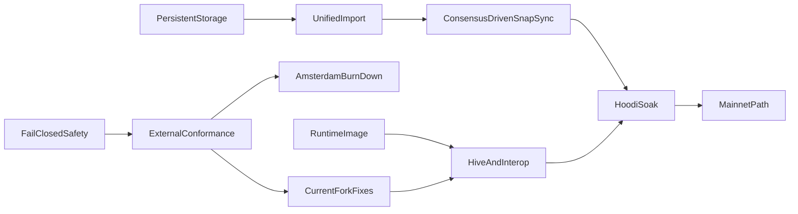

# Public-Testnet Readiness and Mainnet Path

## Audit conclusion

At `578cb476`, the project has broad in-tree implementations and a green CI run,
but it is not public-testnet-ready. The historical remediation documents
frequently mark library code complete even when the running node does not use it.

Release-blocking gaps:

- **Consensus evidence:** CI primarily proves London/Shanghai. It does not
  exercise the active Osaka/BPO2 surface comprehensively, has no Hive gate, and
  has no live EL/CL interop.
- **Incorrect capability claim:** `amsterdam-execution-available-p` in
  `src/runtime/evm/base.lisp` returns true despite missing EIP-2780/EIP-7976,
  incomplete EIP-8246, and stale EIP-8037 system-call gas semantics.
- **Storage scalability:** `devnet-cli-make-output-kv-database` in
  `src/app/cli/devnet/files.lisp` still selects the RAM-resident log backend;
  startup hydrates a `memory-chain-store`, atomic commits copy the entire store,
  and state commits enumerate complete world views.
- **Unsafe sync authority:** `devnet-peer-sync-import-block` in
  `src/app/cli/devnet/peer-sync.lisp` bypasses the consensus header validator,
  is not crash-durable, and lets an execution peer select the canonical PoS
  chain instead of Engine forkchoice.
- **No practical bootstrap:** public presets supply genesis but no bootnodes;
  the live Hello advertises only `eth`; snap and multi-peer implementations have
  no production caller.
- **Remote resource defects:** blob sidecars are stored before transaction
  admission and never reclaimed; payload construction repeatedly re-executes
  prefixes; prepared payloads and several caches are unbounded.
- **Runtime integration:** default IP-literal Engine URLs fail the vhost check,
  public RPC and Engine share one exclusive mutex, WebSocket execution is
  insufficiently bounded, and JWT/node keys are not securely created.
- **Mainnet history:** cumulative total difficulty is not tracked, the real
  Merge transition cannot be selected, and the execution path rejects
  ommers/omits rewards despite documentation claiming end-to-end PoW replay.

Keep the substantial completed work: bounded HTTP/RLP framing, typed
transactions and receipts, txpool limits, KZG/BLS fail-closed behavior,
journaled EVM revert, Engine/public RPC breadth, persistent MPT node primitives,
and in-tree fork tests. Rework only where the live path or external evidence is
missing.

## Pinned verification baseline

- Current stable execution fixtures: `tests@v20.0.1`, commit
  `87aba1a38a476b31f819a2390eb481527e6dc683`, asset SHA-256
  `3586193db06d4d5745d5e90b3c3008c2255a4e19ccd8f11a3ce887aec8c0b17c`.
- Amsterdam feature fixtures: `tests-glamsterdam-devnet@v7.2.1`, commit
  `882909a2c88751a31fa99a65176563a16c527893`, asset SHA-256
  `02e3eca2ede5b424f4dbf2461caf592e6b43b56d55bbd64213dd01f63af9a583`.
- Hive: `dde4f59d04ff0ff8b6585670b08cea1b6c8ab65c`; Execution APIs:
  `e5d1bb60e6c064e4b15080da07b4370d0baadf92`; devp2p specs:
  `51dc101fddd52b5d90e59a2d695a92e4d600cfaf`.
- Preserve the existing pinned geth `38271784...` and Nethermind `e52dc19a...`
  comparisons until deliberately upgraded.

## Dependency order

## Implementation plan

### 1. Restore honest, safe boundaries first

- Set Amsterdam execution unavailable in `src/runtime/evm/base.lisp`; keep
  Engine V5/V6/V4 forkchoice absent until the Amsterdam gate below passes. Split
  KZG point/blob verification from cell-computation capability so
  `engine_getBlobsV4` is advertised only when callable.
- Fix IP-literal vhost handling in `src/transport/http/policy.lisp`.
- Change every thread boundary, including the first two workers in
  `src/app/cli/devnet/background.lisp`, to contain `serious-condition`.
- Create JWT and node-key files atomically with `O_EXCL|O_NOFOLLOW`, mode
  `0600`, and OS CSPRNG only in `src/app/cli/devnet/files.lisp`; require JWT
  when Engine binds non-loopback.
- Reject unknown TOML keys and stop accepting critical no-op flags
  (`--syncmode`, `--db.engine`, `--nodiscover`, discovery/NAT modes) unless
  their behavior is implemented.
- Reconcile the existing uncommitted `README.md` and `docs/validation.md` edits;
  qualify adapter-only RocksDB/snap/discv5/PoW claims. Correct
  `docs/storage-substrate.md`, `docs/architecture.md`, and
  `docs/reference-map.md`.

### 2. Make external conformance non-vacuous

- Add checksum-pinned fetchers for both fixture baselines and update
  `PROJECT.md` only after the new stable corpus is green.
- Generalize `tests/fixture-runner-state-selectors.lisp`,
  `tests/fixture-runner-blockchain-selectors.lisp`, and materializers to execute
  Cancun, Prague, Osaka/BPO2, valid and invalid Engine payload versions,
  transitions, blobs, requests, receipts, and standard RLP blocks.
- Emit and assert selected/executed/skipped counts per fork, family, format, and
  validity. Reject zero aggregate selection before e2e workers are sharded.
- Add a runtime client image and pinned Hive adapter; gate Engine/auth, EELS
  consume-engine/consume-rlp, `rpc-compat`, devp2p, full-sync, and snap suites in
  CI. Add live geth/Nethermind and Lighthouse interop smoke gates.
- Keep documentation transcripts in CI and archive versioned conformance
  reports.

### 3. Replace the memory-mirrored production store

- Introduce a production chain/state provider backed directly by
  `src/foundation/database/rocksdb.lisp`; make public-network datadirs select it
  while retaining memory/file stores as test oracles.
- Replace `chain-store-atomic-commit` in
  `src/storage/node-store/snapshots.lisp` whole-store copies with a changed-key
  journal and one RocksDB write batch covering block, state/trie/code, receipts,
  indexes, sidecars, txpool effects, and checkpoints.
- Make state execution start from the persisted account-trie root, lazily
  resolve hash nodes and storage tries, preserve the trie between blocks, and
  persist only newly allocated dirty paths. Commit touched accounts/slots rather
  than calling full-state iteration in `src/application/services/execution.lisp`.
- Add hash-addressed bytecode, schema-version reads, unknown-version refusal,
  resumable forward migration, finality-aware retention, backup/restore,
  verify/repair/rebuild commands, RocksDB iterator error/range fixes, and
  crash-injection tests.
- Prove per-block and rollback work depends on touched state, not retained
  history or total accounts; prove a dataset larger than RAM opens with bounded
  RSS and restart time.

### 4. Build one validated, durable import service

- Unify Engine, P2P, staged import, local building, and dev-period publication
  behind one service that validates parent/header/body/sidecars, executes,
  derives roots/receipts/requests, commits atomically, then publishes visibility.
- P2P imports remain hash-addressed candidates; only Engine forkchoice may
  update post-Merge canonical/safe/finalized views. Peer-supplied tips cannot
  become canonical merely because they execute.
- Persist peer-sync progress and candidate state through SIGKILL; resume without
  replaying completed ranges. Use the same rollback and durability contract on
  every ingress path.
- Bound remote-block, forkchoice-target, invalid, prepared-payload, and sidecar
  caches by bytes/count/age/finality.

### 5. Complete public bootstrap and continuous sync

- Add canonical bootnodes to `src/protocol/genesis/presets.lisp`, persist node
  identity/ENR sequence, implement `--nodiscover`, and either wire DNS discovery
  and UPnP/NAT-PMP or reject those modes explicitly.
- Add real capability multiplexing and advertise `snap/1` only when both client
  and server are operational. Correct storage value encoding, compact boundary
  range proofs, path-set trie serving, proof verification, bytecode/storage
  healing, pivot selection, and resumable state import.
- Wire the existing multi-peer downloader into the node with wall-clock request
  deadlines, failover, peer scoring, and a consensus-client-authorized target.
  Trigger catch-up on range updates/missed announcements and send outbound
  block/range updates.
- Enforce item caps in every RLP list decoder and negotiated message-id ranges.
  Fix eth/72 versioned blob/cell wrappers and custody masks against pinned geth;
  repair the transaction broadcast cursor so bursts are not dropped.

### 6. Make txpool and payload building bounded and proposer-safe

- Replace separate transaction/sidecar callbacks with atomic pooled-blob
  admission: cheap policy/capacity checks, then KZG, then one mutation. Add
  sidecar ownership/refcounts, data cap, TTL, inclusion/eviction cleanup, and
  persisted admission age.
- Index EIP-7702 authorities rather than rescanning and recovering the entire
  pool; compare eviction by effective executable tip at the child base fee.
- Replace prefix re-execution in `src/api/engine/forkchoice.lisp` with
  incremental execution/checkpoints so each selected transaction executes at
  most once per build.
- Add prepared-payload TTL/cap/finalization pruning, bounded improvement work,
  cancelable shutdown, and Engine-priority scheduling. Public RPC and background
  work must not hold the Engine/import lock across full simulations or scans.

### 7. Burn down current-fork and RPC/Engine failures

- Use the stable fixture/Hive gates to fix every Cancun, Prague, Osaka and BPO2
  divergence before Hoodi. Enforce complete adjacent fork ordering and resolve
  request-system-call semantics against pinned execution specs.
- Fix Engine exact arity/error semantics and run the required Engine-port
  `eth_*` methods through Hive.
- Separate immutable/snapshot public reads from mutation serialization. Add
  streaming/result work budgets before large responses are built.
- Harden WebSocket origins, masking, `ws.api`, notification/batch semantics,
  connection/thread/subscription caps, and deadlines.
- Per the selected scope, keep only bounded, reliable `debug_*` call tracing:
  correct CALLCODE/DELEGATECALL/CREATE frame labels and make block tracing
  linear. Continue to return method-not-found for `trace_*`; do not build broad
  tracer parity.

### 8. Rebase Amsterdam on the current feature fixtures

- Implement and test the complete `tests-glamsterdam-devnet@v7.2.1` inventory,
  especially EIP-2780, EIP-7778, EIP-7976, EIP-7981, current EIP-8037/8038
  accounting/refunds, complete EIP-8246 behavior, and the enlarged
  protocol-system-call state reservoir.
- Run every Amsterdam state/blockchain fixture plus pinned Hive Engine tests,
  with independent negative capability tests for KZG point/blob/cell and BLS
  facilities.
- Re-open `amsterdam-execution-available-p` only when all counts are nonzero,
  all fixtures/Hive pass, and adversarial maximum-gas execution stays within the
  documented resource budget. Track the forthcoming stable `tests@v21` release;
  do not claim parity with an unreleased baseline.

### 9. Complete the mainnet path after Hoodi readiness

- Persist cumulative total difficulty and validate the exact terminal PoW
  block/first PoS child. Correct pre-EIP-158 account creation,
  pre-Berlin/EIP-150 gas gating, ommer execution/rewards, DAO transition, and
  historical receipt behavior.
- Run broad Frontier-through-Merge official blockchain fixtures and Hive
  transition tests; compare selected historical ranges and current
  head/state/RPC outputs with pinned geth/Nethermind.
- Support normal mainnet startup through the same verified snap/checkpoint path
  while retaining exact historical replay as a validation mode. Do not require
  operators to replay PoW history to join.

### 10. Package, observe, and soak

- Create a digest-pinned, multi-stage, non-root runtime image with an entrypoint,
  read-only root filesystem, datadir volume, SBOM, provenance, and signed
  release artifact. Vendor/checksum c-kzg/blst/Quicklisp inputs and pin CI
  actions.
- Add liveness/readiness, sync lag/pivot, import/build/RPC latency, peer quality,
  cache/queue pressure, RocksDB size/errors, pruning/recovery, RSS/GC and reorg
  metrics plus operator runbooks.
- Test SIGTERM deadlines and SIGKILL recovery during active sync, build, reorg,
  pruning, migration and persistence.
- Run a Hoodi shadow node for seven days, comparing canonical
  block/state/receipt/request roots with a reference and remaining within two
  slots through peer churn. Then run a fourteen-day validator soak with no
  client-attributable missed proposal before tagging the public-testnet release.

## Release exit criteria

- Zero open P0 and no remotely exploitable P1 finding.
- Stable current-fork EEST and required Hive suites pass with zero unexpected
  skips and archived count manifests.
- Fresh `--hoodi` discovers peers without manual enodes, performs
  consensus-authorized snap sync from an empty datadir, survives
  interruption/restart, and follows head continuously.
- Every ingress uses the same validated durable import boundary; peer data alone
  never selects canonical PoS state.
- Per-block CPU/I/O scales with touched data; RSS, disk, sidecars, payloads, RPC,
  WebSocket, txpool and peer queues remain within published bounds under hostile
  load.
- Engine latency remains inside consensus-client deadlines under maximum public
  RPC and builder load.
- Runtime artifact is reproducible, non-root, signed, and diagnosable through
  health/metrics/runbooks.
- Mainnet remains explicitly experimental until verified snap-to-head,
  Merge-transition fixtures, historical differential checks, and a separate
  soak pass.
