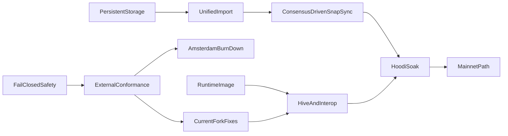

# Public-Testnet Readiness and Mainnet Path

## Audit conclusion

At `578cb476`, the project had broad in-tree implementations and a green CI run,
but was not public-testnet-ready. The current tree has since replaced the
memory-mirrored production store, implemented the unified import boundary, and
implemented the public-bootstrap and continuous-sync machinery in Sections 3
through 5. Section 5 itself remains open until a fresh Hoodi datadir completes
SNAP state download and catches the consensus-authorized head. These changes
remove critical findings from the baseline; they do not make the client
public-testnet-ready.

Remaining release-blocking gaps include:

- **Consensus evidence:** fixture and non-blocking Hive coverage is not yet a
  blocking, zero-unexpected-skip gate over the active Osaka/BPO2 surface, and
  there is no live EL/CL interop gate.
- **Current-fork execution:** Amsterdam is now gated unavailable instead of
  being advertised incorrectly, but EIP-2780/EIP-7778/EIP-7976/EIP-7981,
  complete EIP-8246 behavior, and current EIP-8037/EIP-8038 system-call
  accounting still have to land and pass external conformance.
- **Resource work beyond import caches:** pooled blob transaction and sidecar
  admission is not one atomic ownership/refcount transition, and payload
  construction still repeatedly re-executes prefixes instead of using bounded
  incremental checkpoints.
- **Runtime and release integration:** public RPC and Engine scheduling,
  WebSocket work budgets, a reproducible hardened runtime artifact, operational
  metrics, and live/soak evidence remain release work.
- **Mainnet path:** cumulative total difficulty and the verified real Merge
  selection path remain incomplete; normal mainnet bootstrap, historical
  differential checks, and a separate soak are still required.

Resolved findings relevant to this dependency chain:

- **Production storage:** public-network datadirs select the schema-v4 direct
  RocksDB provider, which point-reads retained chain/state data and commits dirty
  trie paths rather than hydrating and copying a complete memory store.
- **Import authority and recovery:** Engine, P2P, staged, prepared-build, and
  dev-period paths now cross the common block-import service. P2P keeps the
  eth-wire block typed so execution-derived Prague requests and Amsterdam block
  access lists are not erased by an incomplete Engine round-trip, and executes
  only hash-addressed candidates. Outside explicit local `--dev` mode, Engine
  forkchoice owns post-Merge canonical, safe, and finalized publication.
  Persistent peer cursors share the candidate KV batch used for restart
  recovery.
- **Import-side cache bounds:** remote blocks, forkchoice targets, invalid
  blocks, prepared payloads, and blob sidecars now have deterministic
  count/encoded-byte/process-local-age policies plus finality pruning where a
  block number is known. Atomic pooled-blob admission and incremental proposal
  construction stay in Section 6.
- **Public bootstrap and continuous sync:** mainnet, Sepolia, Holesky, and Hoodi
  presets carry pinned canonical discv4 bootnodes; datadirs retain node identity
  and a monotonic ENR sequence; `--nodiscover` is effective in both directions;
  and unsupported DNS/NAT modes fail at startup. `snap/1` is advertised only
  with a verified client and direct-store server. Consensus-authorized pivot
  state now downloads only the 65-block pivot tail, installs a target-bound
  sparse checkpoint atomically, and resumes it across restart; durable
  skeleton/progress, bounded multi-peer deadline/failover, chain
  update wakeups, geth-pinned eth/72 custody/cell shapes, decoder caps, and the
  transaction burst cursor are connected to the production node.

Keep the substantial completed work: bounded HTTP/RLP framing, typed
transactions and receipts, txpool limits, KZG/BLS fail-closed behavior,
journaled EVM revert, Engine/public RPC breadth, persistent MPT node primitives,
and in-tree fork tests. Rework only where the live path or external evidence is
missing.

## Pinned verification baseline

- Current stable execution fixtures: `tests@v20.0.2`, commit
  `abbe05777ab83fb94ce18c425daaa7ab79e779c1`, asset SHA-256
  `1280540950a4c3470a421416b6f35458a9b635827265c29e5aef1ae839ae1788`.
  State tests use the canonical geth test-only `BLOCKHASH` provider,
  `keccak256(decimal(block-number))`, when the static JSON does not serialize
  source-environment block hashes; explicit `blockHashes` and `previousHash`
  fields override it when present.
- Amsterdam feature fixtures: `tests-glamsterdam-devnet@v7.2.1`, commit
  `882909a2c88751a31fa99a65176563a16c527893`, asset SHA-256
  `02e3eca2ede5b424f4dbf2461caf592e6b43b56d55bbd64213dd01f63af9a583`.
- Hive: `dde4f59d04ff0ff8b6585670b08cea1b6c8ab65c`; Execution APIs:
  `e5d1bb60e6c064e4b15080da07b4370d0baadf92`; devp2p specs:
  `51dc101fddd52b5d90e59a2d695a92e4d600cfaf`.
- Preserve the existing pinned geth `38271784...` and Nethermind `e52dc19a...`
  comparisons until deliberately upgraded.

## Dependency order

## Implementation plan

### 1. Restore honest, safe boundaries first

- Set Amsterdam execution unavailable in `src/runtime/evm/base.lisp`; keep
  Engine V5/V6/V4 forkchoice absent until the Amsterdam gate below passes. Split
  KZG point/blob verification from cell-computation capability so
  `engine_getBlobsV4` is advertised only when callable.
- Fix IP-literal vhost handling in `src/transport/http/policy.lisp`.
- Change every thread boundary, including the first two workers in
  `src/app/cli/devnet/background.lisp`, to contain `serious-condition`.
- Create JWT and node-key files atomically with `O_EXCL|O_NOFOLLOW`, mode
  `0600`, and OS CSPRNG only in `src/app/cli/devnet/files.lisp`; require JWT
  when Engine binds non-loopback.
- Reject unknown TOML keys and stop accepting critical no-op flags
  (`--syncmode`, `--db.engine`, `--nodiscover`, discovery/NAT modes) unless
  their behavior is implemented.
- Reconcile the existing uncommitted `README.md` and `docs/validation.md` edits;
  qualify adapter-only RocksDB/snap/discv5/PoW claims. Correct
  `docs/storage-substrate.md`, `docs/architecture.md`, and
  `docs/reference-map.md`.

### 2. Make external conformance non-vacuous

- Add checksum-pinned fetchers for both fixture baselines and update
  `PROJECT.md` only after the new stable corpus is green.
- Generalize `tests/fixture-runner-state-selectors.lisp`,
  `tests/fixture-runner-blockchain-selectors.lisp`, and materializers to execute
  Cancun, Prague, Osaka/BPO2, valid and invalid Engine payload versions,
  transitions, blobs, requests, receipts, and standard RLP blocks.
- Emit and assert selected/executed/skipped counts per fork, family, format, and
  validity. Reject zero aggregate selection before e2e workers are sharded.
- Add a runtime client image and pinned Hive adapter; gate Engine/auth, EELS
  consume-engine/consume-rlp, `rpc-compat`, devp2p, full-sync, and snap suites in
  CI. Add live geth/Nethermind and Lighthouse interop smoke gates.
- Keep documentation transcripts in CI and archive versioned conformance
  reports.

### 3. Replace the memory-mirrored production store

- Introduce a production chain/state provider backed directly by
  `src/foundation/database/rocksdb.lisp`; make public-network datadirs select it
  while retaining memory/file stores as test oracles.
- Replace `chain-store-atomic-commit` in
  `src/storage/node-store/snapshots.lisp` whole-store copies with a changed-key
  journal and one RocksDB write batch covering block, state/trie/code, receipts,
  indexes, sidecars, txpool effects, and checkpoints.
- Make state execution start from the persisted account-trie root, lazily
  resolve hash nodes and storage tries, preserve the trie between blocks, and
  persist only newly allocated dirty paths. Commit touched accounts/slots rather
  than calling full-state iteration in `src/application/services/execution.lisp`.
- Add hash-addressed bytecode, schema-version reads, unknown-version refusal,
  resumable forward migration, finality-aware retention, backup/restore,
  verify/repair/rebuild commands, RocksDB iterator error/range fixes, and
  crash-injection tests.
- Prove per-block and rollback work depends on touched state, not retained
  history or total accounts; prove a dataset larger than RAM opens with bounded
  RSS and restart time.

### 4. Build one validated, durable import service

- Engine, P2P, staged import, local building, and dev-period publication use one
  service that validates parent/header/body/sidecars, executes and verifies
  derived roots/receipts/requests, commits atomically, then publishes only the
  visibility authorized for that operation.
- The historical `:accept-block` handler called
  `engine-new-payload-memory-status` with the wrong arity and argument types, so
  peer propagation always signalled before validation. The P2P adapter now
  keeps fork-derived V1--V5 selection and `block-to-executable-data` conversion
  as a testable mapping boundary, but submits the original typed block through
  `import-p2p-block-candidate`. This distinction is required: eth BlockBodies
  does not carry execution-derived Prague requests or the Amsterdam block access
  list, so reconstructing the candidate from that Engine envelope would replace
  header-committed data with NIL.
- P2P imports remain hash-addressed candidates; only Engine forkchoice may
  update post-Merge canonical/safe/finalized views. Peer-supplied tips cannot
  become canonical merely because they execute. `debug_setHead` refuses a
  post-Merge target and also refuses to rewind from a post-Merge current view;
  the isolated local publisher requires explicit `--dev` before a positive
  dev-period can be configured.
- Persist peer-sync progress and candidate state through SIGKILL; resume without
  replaying completed ranges. An abandoned cursor is deleted durably before
  rebasing to Engine's canonical anchor. If the peer itself reorged after the
  cursor was written, retry once from that anchor; a second mismatch fails
  instead of looping. Use the same rollback and durability contract on every
  ingress path.
- Bound remote-block, forkchoice-target, invalid, prepared-payload, and sidecar
  caches by bytes/count/process-local age/finality. For namespaces restored into
  memory, startup re-admission resets age because timestamps are not durable,
  but enforces count, exact bytes, and known finality before exposing the store.
  Public direct-provider startup re-admits only durable invalid verdicts and
  remote candidates; immutable sidecars remain available through bounded,
  lazy content-addressed point lookups without eager hydration or retaining
  point-read results in memory, while prepared payloads and forkchoice targets
  are deliberately process-private.

The implementation boundary is `src/application/services/block-import.lisp`:

- `import-executable-payload` serves Engine newPayload;
  `import-p2p-block-candidate` serves the typed eth-wire path; and
  `import-block-candidate` serves other typed candidate and staged execution
  paths. They keep validation, execution, candidate visibility, and the final
  durable callback inside one rollback frame. Known valid candidates are
  revalidated without replaying execution; ACCEPTED/SYNCING payloads persist
  only as buffered remote candidates. Deterministic P2P failures enter the same
  invalid cache, so repeats and descendants do not re-execute.
- `build-private-block-candidate` validates Engine proposal work in a deliberate
  rollback frame, so a builder cannot leak state or chain visibility.
  `build-import-and-publish-block` gives the dev-period path one combined
  transaction, and `publish-canonical-block` enforces Engine forkchoice or the
  isolated explicit `--dev` authority before changing checkpoints and canonical
  indexes.
- `src/storage/node-store/persistence/sync-progress.lisp` defines the strict
  peer cursor. The candidate exporter places executed block/state/receipts and
  the cursor in one batch, while the buffered exporter refuses cursor progress.
  The dialer resumes only after verifying the durable candidate, state, and
  ancestry and supplies that hash as the next range's expected parent. It
  durably deletes a cursor abandoned by Engine forkchoice; an anchor mismatch
  from a peer-side reorg gets exactly one retry from the local canonical anchor.
- `src/storage/chain-store/service/cache.lisp` enforces the five policies by
  exact retained protocol bytes, count, age, and known finality, with stable
  `(inserted-at, key)` eviction and no duplicate-refresh loophole within one
  process. Cache timestamps are not persisted: restored records acquire their
  restart admission time. Direct-provider startup streams durable invalid
  verdicts first and remote blocks second, admits each record under the
  count/byte/finality bounds, then deletes rejected records in bounded pages
  together with BAL side data that no other block namespace owns. Durable blob
  sidecars are immutable point-read content rather than an eagerly hydrated
  cache; their ownership/refcount and disk-retention work remains explicitly in
  Section 6. Exact limits are documented in `docs/architecture.md`.

Focused coverage lives in `tests/core-block-import-service-tests.lisp`,
`tests/core-engine-rpc-new-payload-persistence-tests.lisp`,
`tests/core-engine-rpc-forkchoice-persistence-tests.lisp`,
`tests/core-engine-rpc-payload-preparation-tests.lisp`,
`tests/core-node-store-staged-import-tests.lisp`,
`tests/core-node-store-peer-sync-progress-tests.lisp`,
`tests/core-chain-store-cache-bounds-tests.lisp`,
`tests/core-chain-store-invalid-tipset-tests.lisp`,
`tests/core-chain-store-remote-block-tests.lisp`,
`tests/cli-devnet-node-tests.lisp`, `tests/cli-devnet-txpool-period-tests.lisp`,
`tests/debug-tracing-tests.lisp`, `tests/eth-sync-tests.lisp`, and
`tests/database-tests.lisp`.
`rocksdb-peer-sync-candidate-progress-survives-sigkill` kills a child after two
candidate/cursor batches have returned but before a clean close, then reopens
the direct provider and checks candidate state, the last cursor, and the
unchanged canonical parent. The container-only focused and cold commands are in
`docs/validation.md`. These checks define the Section 4 acceptance evidence;
they do not satisfy the bootstrap, external-conformance, resource, packaging,
or soak criteria below, and the cold-layer results remain the authority for a
particular revision.

**Section 4 completion evidence (2026-08-11).** On the final implementation
revision, the container-only cold gates passed with 1,063 unit tests (4 optional
EEST fixture skips), 432 integration tests (8 optional fixture skips), and 64
E2E tests, including both RocksDB peer candidate/cursor and dev-period
publication SIGKILL recovery. `scripts/dev.sh cold-docs` also passed. Section 4
is therefore complete; Sections 5 onward and the external readiness gates below
remain open and must not be inferred from these results.

### 5. Complete public bootstrap and continuous sync

- Add canonical bootnodes to `src/protocol/genesis/presets.lisp`, persist node
  identity/ENR sequence, implement `--nodiscover`, and either wire DNS discovery
  and UPnP/NAT-PMP or reject those modes explicitly.
- Add real capability multiplexing and advertise `snap/1` only when both client
  and server are operational. Correct storage value encoding, compact boundary
  range proofs, path-set trie serving, proof verification, bytecode/storage
  healing, pivot selection, and resumable state import.
- Wire the existing multi-peer downloader into the node with wall-clock request
  deadlines, failover, peer scoring, and a consensus-client-authorized target.
  Trigger catch-up on range updates/missed announcements and send outbound
  block/range updates.
- Enforce item caps in every RLP list decoder and negotiated message-id ranges.
  Fix eth/72 versioned blob/cell wrappers and custody masks against pinned geth;
  repair the transaction broadcast cursor so bursts are not dropped.

The implementation boundary is split deliberately:

- `src/protocol/genesis/presets.lisp` owns pinned seed data;
  `src/app/cli/devnet/files.lisp` owns stable node identity and ENR sequence;
  CLI option parsing makes discovery/NAT refusal observable rather than silently
  accepting a no-op. Public presets use the standard 30303 P2P port unless the
  operator overrides it.
- `src/networking/snap-sync/backend.lisp` and `client.lisp` provide the verified
  server/importer. Compact account/storage proofs, path-set trie responses,
  bytecode/storage healing, target/authority-bound progress, and skeleton
  block/cursor batches all fail closed. Sixty-four durable account ranges match the
  pinned geth scheduler: one worker per live source verifies 512 KiB-soft-limited
  pages concurrently, while the coordinator alone merges state and commits each
  range cursor. The sixty-four partitions remain durable scheduling granularity;
  only sixteen decoded pages may stay claimed through dependency completion,
  matching geth's account concurrency, and
  each page buffers its proof-authenticated account trie records immediately,
  retaining only their 32-byte keys while storage/code work is pending. The
  later synchronous cursor publication flushes that WAL prefix, so prebuffering
  cannot expose incomplete progress across a crash. In addition,
  buffered closure hash sets are released with the rest of the page result, and
  every page profile exposes dynamic heap usage, cumulative allocation, and GC
  CPU time in converted milliseconds for live diagnosis. Every thirty-two
  committed pages revisit promoted SBCL objects. The production
  executable reserves a 6 GiB heap and the reviewed remote gate enforces a 7 GiB
  whole-container ceiling. A failed source releases its range for another peer. Exhausting
  every source in one live-peer snapshot is a typed availability result: the
  long-running CLI coordinator retains verified cursors, refreshes the source
  set, and retries while local persistence/merge faults remain fatal. The CLI
  persists the authenticated prefix of a byte-capped storage response, then
  atomically seeds version-three cursors at the successor of that prefix's last
  authenticated slot and immediately finishes the large trie through one to
  sixteen restart-safe, 512 KiB-capped StorageRanges partitions before the
  owning account cursor can advance. Their count uses go-ethereum v1.17.4's
  exact prefix-density estimate while sixteen durable record slots preserve
  restart compatibility. This also matches its reuse of the initial nil-bound
  response and avoids an explicit origin-zero replay that public hash-scheme
  peers may reject. The first peer begins at 64 KiB; churned peers inherit the
  live pool's mean per-message throughputs. Each names at most `capacity / 1024`
  storage accounts while its request budget adapts up to 512 KiB against the
  same live timeout used for expiry. The exact `f72afc7f` formal deployment
  proved why both inheritance rules are required: its first small reply drove
  the old raw pool estimate to a six-second timeout, producing twelve expiries
  before the run ended. That run also exposed a separate pre-state acquisition
  defect: a durably buffered `ACCEPTED` forward block was treated as fatal.
  Forward range import now continues on `VALID`, `ACCEPTED`, and `SYNCING`, and
  rejects only deterministic `INVALID`, matching the split between Geth block
  acquisition and pivot-state availability. One fixed
  StorageRanges worker per live source drains an import-wide rotating queue of
  open large-root partitions. A lone root can use all of its adaptive chunks;
  rotating after each claim lets other account tasks use idle lanes, matching
  geth v1.17.4's global `assignStorageTasks` behavior without creating one
  all-peer scheduler per account page. Verified partition responses queue at
  one commit coordinator; responses arriving during a write are folded, up to
  sixteen at a time, into the next atomic buffered node/proof/cursor WAL batch.
  The owning account cursor remains behind until every storage job completes;
  its later synchronous batch flushes the preceding WAL prefix, so a crash
  before that seam safely replays storage rather than exposing incomplete
  account progress. Each page publishes reusable four-nibble
  coarse and five-nibble nested storage-subtree proofs with its durable cursor. Legacy
  completed cursors remain range-coverage evidence only: their short-lived
  root-shaped proof is retired, and final healing must establish descendant
  closure before publishing the separate whole-root proof.
  The exact successor `5bdd9aae` formal deployment reused the unchanged
  datadir from `2026-08-26T13:07:56Z`. Its thirteen-minute endpoint had no
  restart, OOM, request timeout, or peer-range fatal and retained thirteen
  peers. Healer progress reached 2,062,336 processed nodes, including 2,059,651
  local reuses and 2,681 remote fetches, while its dynamically discovered
  frontier grew to 27,474; this proves the `f72afc7f` timeout and buffered-block
  failures no longer stop the live node, but not that healing is complete.
  Fresh stores also use geth's exact hash-presence frontier for storage tries:
  open range or fetched nodes carry durable negative markers, and healer DFS
  removes each marker only after its descendants are complete. Account nodes
  cannot use marker absence as closure because their leaves name external code
  and storage dependencies; they retain dependency-carrying subtree proofs.
  Restart does not hydrate the complete retained marker namespace into a Lisp
  hash table. Exact incomplete status is fetched lazily with ordered bounded
  RocksDB MultiGets for the references entering each local DFS batch, while
  bounded in-memory overrides cover freshly fetched markers and completion
  deletes waiting for their buffered batch. Malformed present markers still
  fail closed. A bounded allocation profile of the predecessor runtime had
  attributed 76.3% of samples to the global marker loader and 75.7% to
  per-iterator-key hex rendering; raw bytewise RocksDB range comparisons remove
  that secondary allocation path. Regression controls forbid both production
  behaviors from returning. Restart likewise does not enumerate every retained
  healed-subtree proof to recreate a process-local Bloom. Shallow proof
  candidates use the same bounded exact metadata MultiGets, preserving
  cross-pivot reuse while RocksDB's native point-lookup filters provide the
  storage-level negative cache.
  The closure marker is now epoch three. Epoch two is recognized only for
  migration because it could classify an account node complete before the
  storage/code dependencies named by its leaf were durable. On upgrade, a
  scheme-claiming epoch-two progress record is atomically reopened; its heal
  checkpoint and any pivot state-history publication are removed while all
  content-addressed trie nodes, completed range cursors, and closure-safe proofs
  remain available to the retry.
  When a later account or partitioned StorageRanges page proves closure for a
  node first observed on an open boundary, its atomic proof/record/cursor batch
  removes that superseded negative instead of leaving the final healer to scan
  already-proved state.
  Legacy progress stays conservative, so an upgrade cannot trust unclassified
  nodes. StorageRanges and ByteCodes responses remain assigned through
  independent geth-style idle-peer pools; client proof/hash validation completes
  before the actual dependency peer reservation is released, including every
  partitioned large-storage page. Authenticated StorageRanges tries are expanded
  into records, subtree metadata, and WAL batches only after that release. A
  lane completes that integration before claiming its next page, matching
  geth's main runloop assignment cadence while allowing another live lane to
  use the released peer. A pruned or malformed
  response still retries elsewhere without discarding the verified account page
  or blaming its range peer. The CLI advertises snap only when both sides
  are operational. SNAP request deadlines are no longer a fixed thirty seconds:
  live sessions contribute one cross-message RTT EWMA. The pool caches geth's
  `floor(sqrt(peer-count))` ordered sample with a two--twenty-second clamp,
  updates it at 0.25 impact once per cached RTT, and detunes confidence when a
  small pool gains a peer. Each request receives
  `min(60s, 3 * cached-rtt / confidence)`. Per-message assignments use geth's
  0.1 throughput EWMA and `ceil(1 + 1.01 * throughput * timeout)` rather than a
  separate double/half limiter. Each live request also receives a non-zero,
  session-unique wire id. On expiry, only that immutable request is reverted,
  its message-type capacity records a zero delivery, and the same peer remains
  available; a late response is matched against the wire id and discarded as
  stale instead of closing the RLPx session. The verified response returned to
  the importer carries its original logical id. A cold pool starts from Geth's twenty-second
  RTT and sixty-second allowance; replacement peers inherit live mean
  throughputs, and closed peer snapshots are removed before replacement
  scheduling. Compressed post-Hello devp2p payloads use the runtime's pinned
  libsnappy C API rather than a per-byte Lisp COPY loop; decoded length remains
  capped before allocation, and the pure implementation remains the test
  oracle. TrieNodes healer assignment consumes that same per-peer capacity
  instead of learning a second local value, then applies geth's independently
  tuned local-processing divisor (initially 1,024, with a one-item probe).
  The CLI serves production state
  through the direct RocksDB
  provider. A stale pivot remains
  pinned while a wide source pool or a collapsed pool with bounded aggregate
  throughput is still useful. Once a formerly wide public pool has collapsed
  and five minutes of processed-plus-fetched work falls below the live minimum,
  the coordinator yields to a newer consensus-authorized target while retaining
  all content-addressed state and verified subtree proofs for cross-pivot reuse.
  Operator healing telemetry uses a bounded five-minute frontier window rather
  than treating cumulative processed nodes as remaining work. It reports local
  processing, approximate discovery, and signed net-drain rates; `etaSeconds`
  remains absent while the window is warming, expanding, or unstable. A finite
  ETA appears only after at least five constituent intervals and three fifths
  of them drain the frontier, and is paired with an explicit confidence class.
  Long state-sync writes do not make the consensus client wait for the same
  store guard: `eth_syncing` serves its last consistent snapshot. Its highest
  block includes the durable, persistence-authority-validated SNAP skeleton
  target through an independent RocksDB point read after that target leaves the
  in-memory remote-block queue. The immutable overlay remains available while
  AccountRange or healer owns the ordinary store guard, so those phases cannot
  be misreported as caught up. Meanwhile,
  `engine_getBlobsV3` uses the ordinary cache-aware reader when it can acquire
  the guard immediately and otherwise point-reads only immutable durable
  sidecars. The fallback never observes the mutable sidecar cache without its
  guard, and a sidecar absent from durable storage remains the corresponding
  per-item `null` permitted by the V3 response contract.
  The exact `501159cd` amd64 runtime archive, SHA-256
  `8e23a35f30be2948769648ac14dcd85fc5e63378fc5a97cb426a8074095cbabb`,
  upgraded the exact `a89826b4` process on its unchanged
  `/data/hoodi-sec5-20260814/datadir-4e3d7717` at
  `2026-08-26T19:02:39Z`. The rollback-protected cutover retained the non-root,
  read-only-root, capability-free container boundary. Before the cutover the
  datadir held 34,554,006,720 bytes and the durable target was `0x3562c8`;
  immediately afterwards it held 34,924,990,767 bytes and the target had
  advanced to `0x35637d`. In the first post-cutover request window,
  twenty-five `engine_getBlobsV3` calls took 0--4 ms (0.6 ms mean), 157
  `eth_syncing` calls took at most 188 ms, and Lighthouse reported no Engine
  timeout after the replacement became ready. The seven connection failures
  in that interval were confined to the intentional alias cutover.
  The reviewed restart broker then restarted that same container and datadir
  at `19:10:51Z`: the before/after durable sizes were 34,569,975,005 and
  34,570,066,258 bytes, while `highestBlock` advanced from `0x35637d` to
  `0x3563a3`. Within seventy seconds the resumed healer processed 409,600
  nodes, reused 409,599 locally, issued no remote request, and reconstructed a
  39,780-work live frontier. Post-restart Engine calls had no timeout or OOM;
  `engine_getBlobsV3` remained at most 4 ms, `engine_newPayloadV4` at most
  920 ms, and `engine_forkchoiceUpdatedV3` at most 1,076 ms. This is exact-image
  upgrade, liveness, and same-datadir restart evidence. At the time it did not
  substitute for the final empty-datadir run; the completion evidence below now
  records that separate gate.
- `src/networking/eth-sync/sync.lisp` supplies the bounded downloader, while
  `src/app/cli/devnet/dialer.lisp` owns the continuous coordinator. Work is
  authorized by an Engine target hash, delivered through each session's sole
  writer queue, limited to twice the participating peer count, and retried under
  wall-clock deadlines and peer scoring. Announcements wake the coordinator but
  never become consensus authority; completed work sends range/hash updates.
  Non-empty soft-limited body and complete receipt prefixes are imported once
  and retain their exact suffix in the same bounded delivery window.
- Snap bootstrap persists only pivot-through-target bodies (at most 65), then
  atomically installs the verified state pivot as a sparse checkpoint anchored
  by the Engine target. The full ETH peer pool resolves that target and tail;
  SNAP capability is required only for the subsequent state-root probe and
  download, matching the reference downloader's separation of header and state
  peers. The target stays noncanonical while its at-most-64-block tail executes
  and until an ordinary forkchoiceUpdated publishes it.
- `src/foundation/rlp.lisp`, the protocol decoders, and the eth/snap session
  boundary reject oversized lists and out-of-range message IDs before creating
  unbounded values. eth/72 custody is a 16-byte little-endian bitmap, Cells uses
  bounded flat per-transaction groups and echoes the request mask, and the
  per-peer transaction cursor retains overflow beyond a single broadcast batch.

Focused coverage lives in `tests/core-genesis-tests.lisp`,
`tests/cli-devnet-node-tests.lisp`, `tests/rlp-tests.lisp`,
`tests/p2p-session-tests.lisp`, `tests/eth-wire-tests.lisp`,
`tests/eth-pump-tests.lisp`, `tests/eth-sync-tests.lisp`, `tests/snap-tests.lisp`,
`tests/core-node-store-peer-sync-progress-tests.lisp`, and
`tests/txpool-mining-order-tests.lisp`. The container-only selectors and the
required live Hoodi evidence format are documented in `docs/validation.md`.

**Section 5 bootstrap/restart evidence (2026-08-28; not completion).** Revision
`a176e246abe12cb31b1bb61f80d9b62177bc7702` passed the container-only cold
unit, integration, E2E, and documentation gates with 1,216 unit tests (4
optional fixture skips), 525 integration tests (8 optional fixture skips), and
65 E2E tests. Its reviewed amd64 runtime image passed `runtime-smoke`; the
runtime archive SHA-256 was
`8d6160cc8aa2dcfb00393cdb350a8e4236ee6298f6eaee566228740672152dad`.

The same exact image started on `test-ethereum-server` at
`2026-08-28T15:08:20Z` as the non-root, read-only-root, capability-free,
7-GiB-bounded container `hoodi-lisp-bench-a176e246-fresh-final`, using the
previously absent
`/data/hoodi-sec5-20260828/lisp-a176e246-fresh-final` datadir, the Hoodi preset,
and no static enode. By `15:08:38Z`, preset discovery had produced a
chain-filtered crawl, three sessions had negotiated both `eth/72` and `snap/1`,
five SNAP sources had accepted the consensus-authorized pivot `0x3592bd`, and
the datadir already held 86,331,665 bytes. At `15:14:27Z`, after 175 recent
account-progress events and 310 recent storage-profile events, the datadir held
4,235,543,288 bytes and the consensus target was `0x35931d`.

The reviewed broker then restarted that same container and datadir. Public RPC
returned at `15:15:08Z` with 4,546,818,003 durable bytes and the same authorized
target. By `15:20:20Z`, the resumed import had grown to 9,766,954,843 bytes,
reported 98 further account-progress events and 181 storage-profile events,
retained nine peers, and followed the Lighthouse target forward to `0x359339`.
At `15:21:23Z` both EL and CL were still running without OOM, the EL held ten
peers, and its target had advanced again to `0x35933e`. The restart window had
no pivot-unavailable, dependency-unavailable, or storage-failure event; one
retry-classified import-failure event did not stop subsequent durable progress.
This proves only the Section 5 empty-datadir discovery, capability negotiation,
consensus authorization, restart recovery, and early continuing-head gate. It
does **not** complete Section 5. Completion requires one continuous fresh
datadir run to record `peer.snap.target_completed`, finish the healer with
`completed=true` and an empty frontier, return `eth_syncing=false`, and execute
the canonical EL head through the CL-authorized target (not merely retain a
snap skeleton target while `eth_blockNumber` remains zero). The same revision
must also pass the selected current-fork EEST/fixture and required Hive suites
with zero unexpected skips before its seven-day shadow comparison may count as
Section 10 evidence. The fourteen-day validator soak starts only after that
shadow gate passes.

### 6. Make txpool and payload building bounded and proposer-safe

- Replace separate transaction/sidecar callbacks with atomic pooled-blob
  admission: cheap policy/capacity checks, then KZG, then one mutation. Add
  sidecar ownership/refcounts, data cap, TTL, inclusion/eviction cleanup, and
  persisted admission age.
- Index EIP-7702 authorities rather than rescanning and recovering the entire
  pool; compare eviction by effective executable tip at the child base fee.
- Replace prefix re-execution in `src/api/engine/forkchoice.lisp` with
  incremental execution/checkpoints so each selected transaction executes at
  most once per build.
- Retain the Section 4 prepared-payload TTL/count/byte/finality bounds; add
  bounded improvement work, cancelable shutdown, and Engine-priority scheduling.
  Public RPC and background work must not hold the Engine/import lock across
  full simulations or scans.

### 7. Burn down current-fork and RPC/Engine failures

- Use the stable fixture/Hive gates to fix every Cancun, Prague, Osaka and BPO2
  divergence before Hoodi. Enforce complete adjacent fork ordering and resolve
  request-system-call semantics against pinned execution specs.
- Fix Engine exact arity/error semantics and run the required Engine-port
  `eth_*` methods through Hive.
- Separate immutable/snapshot public reads from mutation serialization. Add
  streaming/result work budgets before large responses are built.
- Harden WebSocket origins, masking, `ws.api`, notification/batch semantics,
  connection/thread/subscription caps, and deadlines.
- Per the selected scope, keep only bounded, reliable `debug_*` call tracing:
  correct CALLCODE/DELEGATECALL/CREATE frame labels and make block tracing
  linear. Continue to return method-not-found for `trace_*`; do not build broad
  tracer parity.

### 8. Rebase Amsterdam on the current feature fixtures

- Implement and test the complete `tests-glamsterdam-devnet@v7.2.1` inventory,
  especially EIP-2780, EIP-7778, EIP-7976, EIP-7981, current EIP-8037/8038
  accounting/refunds, complete EIP-8246 behavior, and the enlarged
  protocol-system-call state reservoir.
- Run every Amsterdam state/blockchain fixture plus pinned Hive Engine tests,
  with independent negative capability tests for KZG point/blob/cell and BLS
  facilities.
- Re-open `amsterdam-execution-available-p` only when all counts are nonzero,
  all fixtures/Hive pass, and adversarial maximum-gas execution stays within the
  documented resource budget. Track the forthcoming stable `tests@v21` release;
  do not claim parity with an unreleased baseline.

### 9. Complete the mainnet path after Hoodi readiness

- Persist cumulative total difficulty and validate the exact terminal PoW
  block/first PoS child. Correct pre-EIP-158 account creation,
  pre-Berlin/EIP-150 gas gating, ommer execution/rewards, DAO transition, and
  historical receipt behavior.
- Run broad Frontier-through-Merge official blockchain fixtures and Hive
  transition tests; compare selected historical ranges and current
  head/state/RPC outputs with pinned geth/Nethermind.
- Support normal mainnet startup through the same verified snap/checkpoint path
  while retaining exact historical replay as a validation mode. Do not require
  operators to replay PoW history to join.

### 10. Package, observe, and soak

- Create a digest-pinned, multi-stage, non-root runtime image with an entrypoint,
  read-only root filesystem, datadir volume, SBOM, provenance, and signed
  release artifact. Vendor/checksum c-kzg/blst/Quicklisp inputs and pin CI
  actions.
- Add liveness/readiness, sync lag/pivot, import/build/RPC latency, peer quality,
  cache/queue pressure, RocksDB size/errors, pruning/recovery, RSS/GC and reorg
  metrics plus operator runbooks.
- Test SIGTERM deadlines and SIGKILL recovery during active sync, build, reorg,
  pruning, migration and persistence.
- Run a Hoodi shadow node for seven days, comparing canonical
  block/state/receipt/request roots with a reference and remaining within two
  slots through peer churn. Then run a fourteen-day validator soak with no
  client-attributable missed proposal before tagging the public-testnet release.

## Release exit criteria

- Zero open P0 and no remotely exploitable P1 finding.
- Stable current-fork EEST and required Hive suites pass with zero unexpected
  skips and archived count manifests.
- Fresh `--hoodi` discovers peers without manual enodes, performs
  consensus-authorized snap sync from an empty datadir, survives
  interruption/restart, and follows head continuously.
- Every ingress uses the same validated durable import boundary; peer data alone
  never selects canonical PoS state.
- Per-block CPU/I/O scales with touched data; RSS, disk, sidecars, payloads, RPC,
  WebSocket, txpool and peer queues remain within published bounds under hostile
  load.
- Engine latency remains inside consensus-client deadlines under maximum public
  RPC and builder load.
- Runtime artifact is reproducible, non-root, signed, and diagnosable through
  health/metrics/runbooks.
- Mainnet remains explicitly experimental until verified snap-to-head,
  Merge-transition fixtures, historical differential checks, and a separate
  soak pass.
