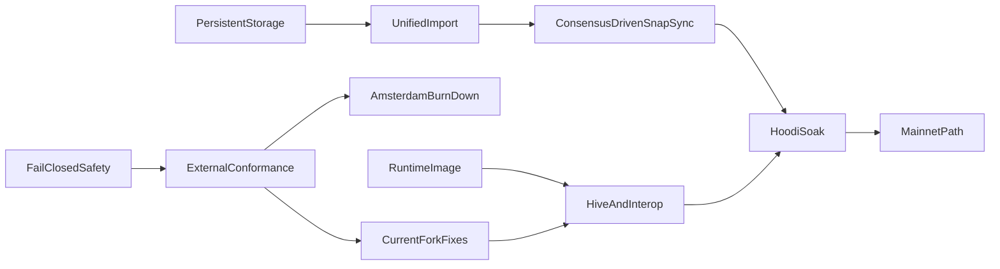

# Public-Testnet Readiness and Mainnet Path

## Audit conclusion

At `578cb476`, the project had broad in-tree implementations and a green CI run,
but was not public-testnet-ready. The current tree has since replaced the
memory-mirrored production store, implemented the unified import boundary, and
implemented the public-bootstrap and continuous-sync machinery in Sections 3
through 5. Section 5 itself remains open until a fresh Hoodi datadir completes
SNAP state download and catches the consensus-authorized head. These changes
remove critical findings from the baseline; they do not make the client
public-testnet-ready.

Remaining release-blocking gaps include:

- **Consensus evidence:** fixture and non-blocking Hive coverage is not yet a
  blocking, zero-unexpected-skip gate over the active Osaka/BPO2 surface, and
  there is no live EL/CL interop gate.
- **Current-fork execution:** Amsterdam is now gated unavailable instead of
  being advertised incorrectly, but EIP-2780/EIP-7778/EIP-7976/EIP-7981,
  complete EIP-8246 behavior, and current EIP-8037/EIP-8038 system-call
  accounting still have to land and pass external conformance.
- **Resource work beyond import caches:** pooled blob transaction and sidecar
  admission is not one atomic ownership/refcount transition, and payload
  construction still repeatedly re-executes prefixes instead of using bounded
  incremental checkpoints.
- **Runtime and release integration:** public RPC and Engine scheduling,
  WebSocket work budgets, a reproducible hardened runtime artifact, operational
  metrics, and live/soak evidence remain release work.
- **Mainnet path:** cumulative total difficulty and the verified real Merge
  selection path remain incomplete; normal mainnet bootstrap, historical
  differential checks, and a separate soak are still required.

Resolved findings relevant to this dependency chain:

- **Production storage:** public-network datadirs select the schema-v4 direct
  RocksDB provider, which point-reads retained chain/state data and commits dirty
  trie paths rather than hydrating and copying a complete memory store.
- **Import authority and recovery:** Engine, P2P, staged, prepared-build, and
  dev-period paths now cross the common block-import service. P2P keeps the
  eth-wire block typed so execution-derived Prague requests and Amsterdam block
  access lists are not erased by an incomplete Engine round-trip, and executes
  only hash-addressed candidates. Outside explicit local `--dev` mode, Engine
  forkchoice owns post-Merge canonical, safe, and finalized publication.
  Persistent peer cursors share the candidate KV batch used for restart
  recovery.
- **Import-side cache bounds:** remote blocks, forkchoice targets, invalid
  blocks, prepared payloads, and blob sidecars now have deterministic
  count/encoded-byte/process-local-age policies plus finality pruning where a
  block number is known. Atomic pooled-blob admission and incremental proposal
  construction stay in Section 6.
- **Public bootstrap and continuous sync:** mainnet, Sepolia, Holesky, and Hoodi
  presets carry pinned canonical discv4 bootnodes; datadirs retain node identity
  and a monotonic ENR sequence; `--nodiscover` is effective in both directions;
  and unsupported DNS/NAT modes fail at startup. `snap/1` is advertised only
  with a verified client and direct-store server. Consensus-authorized pivot
  state now downloads only the 65-block pivot tail, installs a target-bound
  sparse checkpoint atomically, and resumes it across restart; durable
  skeleton/progress, bounded multi-peer deadline/failover, chain
  update wakeups, geth-pinned eth/72 custody/cell shapes, decoder caps, and the
  transaction burst cursor are connected to the production node.

Keep the substantial completed work: bounded HTTP/RLP framing, typed
transactions and receipts, txpool limits, KZG/BLS fail-closed behavior,
journaled EVM revert, Engine/public RPC breadth, persistent MPT node primitives,
and in-tree fork tests. Rework only where the live path or external evidence is
missing.

## Pinned verification baseline

- Current stable execution fixtures: `tests@v20.0.2`, commit
  `abbe05777ab83fb94ce18c425daaa7ab79e779c1`, asset SHA-256
  `1280540950a4c3470a421416b6f35458a9b635827265c29e5aef1ae839ae1788`.
  State tests use the canonical geth test-only `BLOCKHASH` provider,
  `keccak256(decimal(block-number))`, when the static JSON does not serialize
  source-environment block hashes; explicit `blockHashes` and `previousHash`
  fields override it when present.
- Amsterdam feature fixtures: `tests-glamsterdam-devnet@v7.2.1`, commit
  `882909a2c88751a31fa99a65176563a16c527893`, asset SHA-256
  `02e3eca2ede5b424f4dbf2461caf592e6b43b56d55bbd64213dd01f63af9a583`.
- Hive: `dde4f59d04ff0ff8b6585670b08cea1b6c8ab65c`; Execution APIs:
  `e5d1bb60e6c064e4b15080da07b4370d0baadf92`; devp2p specs:
  `51dc101fddd52b5d90e59a2d695a92e4d600cfaf`.
- Preserve the existing pinned geth `38271784...` and Nethermind `e52dc19a...`
  comparisons until deliberately upgraded.

## Dependency order

## Implementation plan

### 1. Restore honest, safe boundaries first

- Set Amsterdam execution unavailable in `src/runtime/evm/base.lisp`; keep
  Engine V5/V6/V4 forkchoice absent until the Amsterdam gate below passes. Split
  KZG point/blob verification from cell-computation capability so
  `engine_getBlobsV4` is advertised only when callable.
- Fix IP-literal vhost handling in `src/transport/http/policy.lisp`.
- Change every thread boundary, including the first two workers in
  `src/app/cli/devnet/background.lisp`, to contain `serious-condition`.
- Create JWT and node-key files atomically with `O_EXCL|O_NOFOLLOW`, mode
  `0600`, and OS CSPRNG only in `src/app/cli/devnet/files.lisp`; require JWT
  when Engine binds non-loopback.
- Reject unknown TOML keys and stop accepting critical no-op flags
  (`--syncmode`, `--db.engine`, `--nodiscover`, discovery/NAT modes) unless
  their behavior is implemented.
- Reconcile the existing uncommitted `README.md` and `docs/validation.md` edits;
  qualify adapter-only RocksDB/snap/discv5/PoW claims. Correct
  `docs/storage-substrate.md`, `docs/architecture.md`, and
  `docs/reference-map.md`.

### 2. Make external conformance non-vacuous

- Add checksum-pinned fetchers for both fixture baselines and update
  `PROJECT.md` only after the new stable corpus is green.
- Generalize `tests/fixture-runner-state-selectors.lisp`,
  `tests/fixture-runner-blockchain-selectors.lisp`, and materializers to execute
  Cancun, Prague, Osaka/BPO2, valid and invalid Engine payload versions,
  transitions, blobs, requests, receipts, and standard RLP blocks.
- Emit and assert selected/executed/skipped counts per fork, family, format, and
  validity. Reject zero aggregate selection before e2e workers are sharded.
- Add a runtime client image and pinned Hive adapter; gate Engine/auth, EELS
  consume-engine/consume-rlp, `rpc-compat`, devp2p, full-sync, and snap suites in
  CI. Add live geth/Nethermind and Lighthouse interop smoke gates.
- Keep documentation transcripts in CI and archive versioned conformance
  reports.

### 3. Replace the memory-mirrored production store

- Introduce a production chain/state provider backed directly by
  `src/foundation/database/rocksdb.lisp`; make public-network datadirs select it
  while retaining memory/file stores as test oracles.
- Replace `chain-store-atomic-commit` in
  `src/storage/node-store/snapshots.lisp` whole-store copies with a changed-key
  journal and one RocksDB write batch covering block, state/trie/code, receipts,
  indexes, sidecars, txpool effects, and checkpoints.
- Make state execution start from the persisted account-trie root, lazily
  resolve hash nodes and storage tries, preserve the trie between blocks, and
  persist only newly allocated dirty paths. Commit touched accounts/slots rather
  than calling full-state iteration in `src/application/services/execution.lisp`.
- Add hash-addressed bytecode, schema-version reads, unknown-version refusal,
  resumable forward migration, finality-aware retention, backup/restore,
  verify/repair/rebuild commands, RocksDB iterator error/range fixes, and
  crash-injection tests.
- Prove per-block and rollback work depends on touched state, not retained
  history or total accounts; prove a dataset larger than RAM opens with bounded
  RSS and restart time.

### 4. Build one validated, durable import service

- Engine, P2P, staged import, local building, and dev-period publication use one
  service that validates parent/header/body/sidecars, executes and verifies
  derived roots/receipts/requests, commits atomically, then publishes only the
  visibility authorized for that operation.
- The historical `:accept-block` handler called
  `engine-new-payload-memory-status` with the wrong arity and argument types, so
  peer propagation always signalled before validation. The P2P adapter now
  keeps fork-derived V1--V5 selection and `block-to-executable-data` conversion
  as a testable mapping boundary, but submits the original typed block through
  `import-p2p-block-candidate`. This distinction is required: eth BlockBodies
  does not carry execution-derived Prague requests or the Amsterdam block access
  list, so reconstructing the candidate from that Engine envelope would replace
  header-committed data with NIL.
- P2P imports remain hash-addressed candidates; only Engine forkchoice may
  update post-Merge canonical/safe/finalized views. Peer-supplied tips cannot
  become canonical merely because they execute. `debug_setHead` refuses a
  post-Merge target and also refuses to rewind from a post-Merge current view;
  the isolated local publisher requires explicit `--dev` before a positive
  dev-period can be configured.
- Persist peer-sync progress and candidate state through SIGKILL; resume without
  replaying completed ranges. An abandoned cursor is deleted durably before
  rebasing to Engine's canonical anchor. If the peer itself reorged after the
  cursor was written, retry once from that anchor; a second mismatch fails
  instead of looping. Use the same rollback and durability contract on every
  ingress path.
- Bound remote-block, forkchoice-target, invalid, prepared-payload, and sidecar
  caches by bytes/count/process-local age/finality. For namespaces restored into
  memory, startup re-admission resets age because timestamps are not durable,
  but enforces count, exact bytes, and known finality before exposing the store.
  Public direct-provider startup re-admits only durable invalid verdicts and
  remote candidates; immutable sidecars remain available through bounded,
  lazy content-addressed point lookups without eager hydration or retaining
  point-read results in memory, while prepared payloads and forkchoice targets
  are deliberately process-private.

The implementation boundary is `src/application/services/block-import.lisp`:

- `import-executable-payload` serves Engine newPayload;
  `import-p2p-block-candidate` serves the typed eth-wire path; and
  `import-block-candidate` serves other typed candidate and staged execution
  paths. They keep validation, execution, candidate visibility, and the final
  durable callback inside one rollback frame. Known valid candidates are
  revalidated without replaying execution; ACCEPTED/SYNCING payloads persist
  only as buffered remote candidates. Deterministic P2P failures enter the same
  invalid cache, so repeats and descendants do not re-execute.
- `build-private-block-candidate` validates Engine proposal work in a deliberate
  rollback frame, so a builder cannot leak state or chain visibility.
  `build-import-and-publish-block` gives the dev-period path one combined
  transaction, and `publish-canonical-block` enforces Engine forkchoice or the
  isolated explicit `--dev` authority before changing checkpoints and canonical
  indexes.
- `src/storage/node-store/persistence/sync-progress.lisp` defines the strict
  peer cursor. The candidate exporter places executed block/state/receipts and
  the cursor in one batch, while the buffered exporter refuses cursor progress.
  The dialer resumes only after verifying the durable candidate, state, and
  ancestry and supplies that hash as the next range's expected parent. It
  durably deletes a cursor abandoned by Engine forkchoice; an anchor mismatch
  from a peer-side reorg gets exactly one retry from the local canonical anchor.
- `src/storage/chain-store/service/cache.lisp` enforces the five policies by
  exact retained protocol bytes, count, age, and known finality, with stable
  `(inserted-at, key)` eviction and no duplicate-refresh loophole within one
  process. Cache timestamps are not persisted: restored records acquire their
  restart admission time. Direct-provider startup streams durable invalid
  verdicts first and remote blocks second, admits each record under the
  count/byte/finality bounds, then deletes rejected records in bounded pages
  together with BAL side data that no other block namespace owns. Durable blob
  sidecars are immutable point-read content rather than an eagerly hydrated
  cache; their ownership/refcount and disk-retention work remains explicitly in
  Section 6. Exact limits are documented in `docs/architecture.md`.

Focused coverage lives in `tests/core-block-import-service-tests.lisp`,
`tests/core-engine-rpc-new-payload-persistence-tests.lisp`,
`tests/core-engine-rpc-forkchoice-persistence-tests.lisp`,
`tests/core-engine-rpc-payload-preparation-tests.lisp`,
`tests/core-node-store-staged-import-tests.lisp`,
`tests/core-node-store-peer-sync-progress-tests.lisp`,
`tests/core-chain-store-cache-bounds-tests.lisp`,
`tests/core-chain-store-invalid-tipset-tests.lisp`,
`tests/core-chain-store-remote-block-tests.lisp`,
`tests/cli-devnet-node-tests.lisp`, `tests/cli-devnet-txpool-period-tests.lisp`,
`tests/debug-tracing-tests.lisp`, `tests/eth-sync-tests.lisp`, and
`tests/database-tests.lisp`.
`rocksdb-peer-sync-candidate-progress-survives-sigkill` kills a child after two
candidate/cursor batches have returned but before a clean close, then reopens
the direct provider and checks candidate state, the last cursor, and the
unchanged canonical parent. The container-only focused and cold commands are in
`docs/validation.md`. These checks define the Section 4 acceptance evidence;
they do not satisfy the bootstrap, external-conformance, resource, packaging,
or soak criteria below, and the cold-layer results remain the authority for a
particular revision.

**Section 4 completion evidence (2026-08-11).** On the final implementation
revision, the container-only cold gates passed with 1,063 unit tests (4 optional
EEST fixture skips), 432 integration tests (8 optional fixture skips), and 64
E2E tests, including both RocksDB peer candidate/cursor and dev-period
publication SIGKILL recovery. `scripts/dev.sh cold-docs` also passed. Section 4
is therefore complete; Sections 5 onward and the external readiness gates below
remain open and must not be inferred from these results.

### 5. Complete public bootstrap and continuous sync

- Add canonical bootnodes to `src/protocol/genesis/presets.lisp`, persist node
  identity/ENR sequence, implement `--nodiscover`, and either wire DNS discovery
  and UPnP/NAT-PMP or reject those modes explicitly.
- Add real capability multiplexing and advertise `snap/1` only when both client
  and server are operational. Correct storage value encoding, compact boundary
  range proofs, path-set trie serving, proof verification, bytecode/storage
  healing, pivot selection, and resumable state import.
- Wire the existing multi-peer downloader into the node with wall-clock request
  deadlines, failover, peer scoring, and a consensus-client-authorized target.
  Trigger catch-up on range updates/missed announcements and send outbound
  block/range updates.
- Enforce item caps in every RLP list decoder and negotiated message-id ranges.
  Fix eth/72 versioned blob/cell wrappers and custody masks against pinned geth;
  repair the transaction broadcast cursor so bursts are not dropped.

The implementation boundary is split deliberately:

- `src/protocol/genesis/presets.lisp` owns pinned seed data;
  `src/app/cli/devnet/files.lisp` owns stable node identity and ENR sequence;
  CLI option parsing makes discovery/NAT refusal observable rather than silently
  accepting a no-op. Public presets use the standard 30303 P2P port unless the
  operator overrides it.
- `src/networking/snap-sync/backend.lisp` and `client.lisp` provide the verified
  server/importer. Compact account/storage proofs, path-set trie responses,
  bytecode/storage healing, target/authority-bound progress, and skeleton
  block/cursor batches all fail closed. Sixty-four durable account ranges match the
  pinned geth scheduler: one worker per live source verifies 512 KiB-soft-limited
  pages concurrently, while the coordinator alone merges state and commits each
  range cursor. The sixty-four partitions remain durable scheduling granularity;
  only sixteen decoded pages may stay claimed through dependency completion,
  matching geth's account concurrency, and
  each page buffers its proof-authenticated account trie records immediately,
  retaining only their 32-byte keys while storage/code work is pending. The
  later synchronous cursor publication flushes that WAL prefix, so prebuffering
  cannot expose incomplete progress across a crash. In addition,
  buffered closure hash sets are released with the rest of the page result, and
  every page profile exposes dynamic heap usage, cumulative allocation, and GC
  CPU time in converted milliseconds for live diagnosis. Every thirty-two
  committed pages revisit promoted SBCL objects. The production
  executable reserves a 6 GiB heap and the reviewed remote gate enforces a 7 GiB
  whole-container ceiling. A failed source releases its range for another peer. Exhausting
  every source in one live-peer snapshot is a typed availability result: the
  long-running CLI coordinator retains verified cursors, refreshes the source
  set, and retries while local persistence/merge faults remain fatal. The CLI
  persists the authenticated prefix of a byte-capped storage response, then
  atomically seeds version-three cursors at the successor of that prefix's last
  authenticated slot and immediately finishes the large trie through one to
  sixteen restart-safe, 512 KiB-capped StorageRanges partitions before the
  owning account cursor can advance. Their count uses go-ethereum v1.17.4's
  exact prefix-density estimate while sixteen durable record slots preserve
  restart compatibility. This also matches its reuse of the initial nil-bound
  response and avoids an explicit origin-zero replay that public hash-scheme
  peers may reject. The first peer begins at 64 KiB; churned peers inherit the
  live pool's mean per-message throughputs. Each names at most `capacity / 1024`
  storage accounts while its request budget adapts up to 512 KiB against the
  same live timeout used for expiry. The exact `f72afc7f` formal deployment
  proved why both inheritance rules are required: its first small reply drove
  the old raw pool estimate to a six-second timeout, producing twelve expiries
  before the run ended. That run also exposed a separate pre-state acquisition
  defect: a durably buffered `ACCEPTED` forward block was treated as fatal.
  Forward range import now continues on `VALID`, `ACCEPTED`, and `SYNCING`, and
  rejects only deterministic `INVALID`, matching the split between Geth block
  acquisition and pivot-state availability. One fixed
  StorageRanges worker per live source drains an import-wide rotating queue of
  open large-root partitions. A lone root can use all of its adaptive chunks;
  rotating after each claim lets other account tasks use idle lanes, matching
  geth v1.17.4's global `assignStorageTasks` behavior without creating one
  all-peer scheduler per account page. Verified partition responses queue at
  one commit coordinator; responses arriving during a write are folded, up to
  sixteen at a time, into the next atomic buffered node/proof/cursor WAL batch.
  The owning account cursor remains behind until every storage job completes;
  its later synchronous batch flushes the preceding WAL prefix, so a crash
  before that seam safely replays storage rather than exposing incomplete
  account progress. Each page publishes reusable four-nibble
  coarse and five-nibble nested storage-subtree proofs with its durable cursor. Legacy
  completed cursors remain range-coverage evidence only: their short-lived
  root-shaped proof is retired, and final healing must establish descendant
  closure before publishing the separate whole-root proof.
  The exact successor `5bdd9aae` formal deployment reused the unchanged
  datadir from `2026-08-26T13:07:56Z`. Its thirteen-minute endpoint had no
  restart, OOM, request timeout, or peer-range fatal and retained thirteen
  peers. Healer progress reached 2,062,336 processed nodes, including 2,059,651
  local reuses and 2,681 remote fetches, while its dynamically discovered
  frontier grew to 27,474; this proves the `f72afc7f` timeout and buffered-block
  failures no longer stop the live node, but not that healing is complete.
  Fresh stores retain exact per-node incomplete markers for conservative healer
  traversal: open range or fetched nodes carry durable negative markers, and
  healer DFS removes each marker only after its descendants are complete.
  Marker absence is not itself closure proof for either account or storage
  nodes, because legacy or interrupted writers can leave a present unmarked
  parent above a missing child. Both trie kinds skip only through explicit
  versioned healed-subtree proofs; account proofs additionally carry the code
  and storage dependencies named by their leaves.
  Restart does not hydrate the complete retained marker namespace into a Lisp
  hash table. Exact incomplete status is fetched lazily with ordered bounded
  RocksDB MultiGets for the references entering each local DFS batch, while
  bounded in-memory overrides cover freshly fetched markers and completion
  deletes waiting for their buffered batch. Malformed present markers still
  fail closed. A bounded allocation profile of the predecessor runtime had
  attributed 76.3% of samples to the global marker loader and 75.7% to
  per-iterator-key hex rendering; raw bytewise RocksDB range comparisons remove
  that secondary allocation path. Regression controls forbid both production
  behaviors from returning. Restart likewise does not enumerate every retained
  healed-subtree proof to recreate a process-local Bloom. Shallow proof
  candidates use the same bounded exact metadata MultiGets, preserving
  cross-pivot reuse while RocksDB's native point-lookup filters provide the
  storage-level negative cache.
  The closure marker is now epoch five. Epochs one through four are recognized
  only for migration: epoch two could classify an account node complete before
  the storage/code dependencies named by its leaf were durable, epoch three
  could publish a generic account-subtree proof from bare account-node presence,
  and epoch four could publish storage proofs from bare storage-node presence.
  On upgrade, a scheme-claiming older progress record is atomically reopened;
  its heal checkpoint and any pivot state-history publication are removed while
  content-addressed trie nodes, completed range cursors, and closure-safe
  storage/dependency proofs remain available to the retry. The later exact
  `03263d2f` amd64 deployment exposed the epoch-three account-closure seam: pivot
  3,580,247 reported `completed=T`, `frontierWorks=0`, and
  `knownIncompleteNodes=0` at `2026-09-08T02:14:22Z`, then exited 16 seconds
  later on missing persisted trie node `0x180b...4acf` before any
  `peer.snap.target_completed` event. The full evidence is archived in
  `docs/evidence/sec5-03263d2f-account-closure-failure.txt`. Epoch-four account
  records prebuffered before dependency completion receive incomplete markers
  in the same node batch, the healer no longer treats bare account-node presence
  as closure, and account-subtree proofs use a fresh namespace so unsafe v2
  proofs are not consumed; only current dependency-carrying proofs may skip that
  walk. This is a tested repair, not live completion evidence.
  Exact successor `b23c7d57` then exposed the corresponding storage-closure
  seam: pivot 3,593,969 reported `completed=T`, `frontierWorks=0`, and
  `knownIncompleteNodes=0` at `2026-09-10T04:32:24Z`, then exited 26 seconds
  later on missing persisted trie node `0x5dc4...5b95` before any
  `peer.snap.target_completed` event. The evidence is archived in
  `docs/evidence/sec5-b23c7d57-storage-closure-failure.txt`. A focused
  regression reproduces an unmarked persisted storage parent above an absent
  descendant: marker-only closure fetches nothing and leaves the hole, whereas
  requiring a current versioned subtree proof fetches and persists it. Storage
  proof namespaces are advanced so an upgrade cannot consume a proof published
  by the unsafe revision. This repair is locally tested and still requires
  exact-artifact live validation.

  The same exact implementation revision `d9e0e2dd74ced0baddc63a0e43881c53be302df6`
  passed the pinned stable `tests@v20.0.2` current-fork EEST executors on
  `2026-09-10`. The checksum-matched corpus selected 15,393 state cases,
  11,382 Engine blockchain-replay cases, and 10,257 RLP blockchain-replay
  cases across the configured London-through-Osaka surface. Every selected
  valid and invalid vector executed through its aggregate top-level gate;
  manifests recorded zero unexpected skips, with only 579 named multi-payload
  and 636 named format-inapplicable blockchain cases excluded as expected.
  The adjacent cold-unit layer passed 1,337 tests with three optional,
  corpus-inapplicable skips. Exact selectors, counts, hashes, retained-container
  results, and the separately disclosed aggregate caller timeout are archived
  in `docs/evidence/sec5-d9e0e2dd-eest-v20.0.2.txt`. The exact live
  application revision `0c6b51bf6ea4852ddf2baf47147ce0ab24bbf4ae` later
  repeated the three non-vacuity manifests and all five aggregate fixture
  executors against the same checksum-matched corpus. The counts were unchanged:
  15,393 state cases, 11,382 Engine blockchain-replay cases, and 10,257 RLP
  blockchain-replay cases, with zero unexpected skips; all eight focused gates
  exited zero without OOM. Exact selectors and durable log hashes are archived
  in `docs/evidence/sec5-0c6b51bf-eest-v20.0.2.txt`. This closes the stable
  current-fork EEST prerequisite for the revision under fresh Hoodi validation,
  but not its live/soak gates.

  Exact branch revision `81446d476c9bb36db745cda202052cb61714ffb7` later repeated
  the checksum-matched current-fork gate after the intervening networking and
  txpool repairs. It executed all 15,393 selected state cases, 11,382 selected
  Engine blockchain-replay cases, and 10,257 selected RLP blockchain-replay
  cases across London through Osaka with zero unexpected skips. The adjacent
  cold layers passed 1,360 unit tests with three optional skips and 573
  integration tests. The generated six-line manifest is archived in
  `docs/evidence/sec5-81446d47-eest-v20.0.2.txt`. This proves no EEST regression
  at the exact branch revision; it does not substitute for the still-open Hive,
  Hoodi completion, shadow, or validator gates.

  Exact successor `6e3e9b1ddd3c890c98db04d2bd5f367ce2300bad` closes the
  pinned Hive rpc-compat gate. Its reviewed linux/amd64 runtime ran Hive
  `dde4f59d` with Execution APIs `e5d1bb60`, selected exactly 234 unique cases,
  and passed 234/234 with zero failures. All four `testing_buildBlockV1` cases
  passed, the selected name set exactly matched the retained r18 inventory, and
  there was no passed-to-failed regression. The bounded runner exited zero
  without OOM or restart and retained its unique evidence directory. Exact
  artifact, result, log, and runner hashes are archived in
  `docs/evidence/sec5-6e3e9b1d-hive-rpc-compat.txt`. This closes the required
  rpc-compat rerun; the live completion, shadow, and validator-soak gates remain
  open.

  A full pinned 403-item Hive Engine/auth run at that revision reached 346
  unique results before its 3-GiB runner was OOM-killed, so it is retained as
  failure evidence rather than a completed gate. One deterministic failure in
  that partial result was Cancun's `Blob Transaction Ordering, Multiple
  Clients`: the client returned the wrong proof at index five. Exact successor
  `694667f95727430baef2aaceec24c91c2c46bd91` validates the cell sidecar and
  derives each blob proof from its blob and commitment. Its reviewed
  linux/amd64 runtime then selected the exact named regression plus its suite
  loader and passed both entries, with Hive exit zero and no runner OOM or
  restart. Exact artifact and evidence hashes are archived in
  `docs/evidence/sec5-694667f9-hive-blob-order.txt`.

  Three subsequent bounded full Engine/auth runs executed the complete
  403-name inventory without outer-runner OOM or interruption and passed
  399/403, 400/403, and 401/403. Every failure passed in another run, and the
  moving sets were disjoint connection resets at the initial Engine boundary.
  A fourth complete run retained the exact source, runtime, Hive, runner, and
  name inventory while raising only the outer runner from 4/5 GiB memory/
  memory-plus-swap to 8/10 GiB. It passed all 403/403: engine-api 129/129,
  engine-auth 8/8, engine-exchange-capabilities 5/5, engine-withdrawals 35/35,
  and engine-cancun 226/226. The runner exited zero without OOM or restart;
  all 496 result/simulator/details/client-log references were present and
  bounded, and the independent readback recomputed the complete 512-entry
  evidence manifest. This closes the pinned Engine/auth zero-failure gate for
  the exact revision. Exact per-suite counts, artifact hashes, and all retained
  evidence roots are archived in
  `docs/evidence/sec5-694667f9-hive-engine-r25-r26.txt`.

  The first complete Hive devp2p discovery baseline at exact client revision
  `b7bdb6daa2073ece9fd595dfa3e27faf882230a8` executed 33 entries and passed
  1/33 with zero skips. The 24 remaining eth entries and all six snap entries
  were blocked by one Status fork-ID mismatch: the adapter discarded
  `osakaTime=180` from the uploaded testchain genesis because the matching
  `HIVE_OSAKA_TIMESTAMP` was absent from its forkenv. Folding that missing
  timestamp changes the client's `0x9736aeb1` to the test tool's exact
  `0x15e3c946`. The mapper now preserves supported source time-fork activations
  unless Hive explicitly overrides them, and the adapter smoke has a passing
  RED/GREEN control. The two discovery entries independently failed because
  their simulator cases upload no genesis. The adapter now carries Hive's
  pinned standard minimal genesis as the same fallback used by standard eth1
  clients; simulator uploads still replace that path. A focused adapter
  RED/GREEN control proves both fallback startup and uploaded-genesis override.
  The CLI currently serves discv4 only, so `HIVE_DISCV5` is now explicitly
  refused rather than silently entering a v5 suite with the v4 service.
  No successor Hive rerun has occurred, so the devp2p gate remains open. The
  discovery Dockerfile also cloned moving geth master; the retained layer pins
  this run's observed source to `101035a1049c7dc468bfe973478b579d9883d7b6`.
  The runner now stages a reviewed simulator Dockerfile that fetches and
  verifies exactly that commit, and passes the same value as an explicit Hive
  simulator build argument. Revision
  `7b3e9d3590a774d37db32faa9400f323d6c1c3f0` now has an exact linux/amd64
  runtime image and source archive prepared for the successor run. The runtime
  archive SHA-256 is
  `84111e9e69e7d09ee3d04d171fc5c80bb46a73c5d9db39efe770e8b1b614c54a`;
  runtime smoke and the complete adapter smoke pass. A successor Linux run
  remains required. Exact
  failure partition, runner identities, hashes, and local test commands are in
  `docs/evidence/sec5-b7bdb6da-hive-devp2p-discovery.txt`; the discovery
  fallback repair is recorded in
  `docs/evidence/sec5-0ba3a950-hive-discovery-genesis.txt`; deterministic
  simulator-source preparation is recorded in
  `docs/evidence/sec5-f19ee8d5-hive-devp2p-geth-pin.txt`; exact artifact
  identities and gates are in
  `docs/evidence/sec5-7b3e9d35-amd64-artifacts.txt`.

  A later exact-`f79f5b2e` bounded run passed discv4 16/16 and 14/19 eth
  entries; its intentionally refused, unsupported discv5 launch failed.
  `LargeTxRequest` failed after its roughly 2,000-transaction send
  ended in a connection read timeout. Three following transaction-related cases
  failed on read timeouts, the enclosing eth launch hit the two-hour host
  timeout, and SNAP was never reached: 30/36 enumerated entries passed instead
  of completing the required 48-entry inventory. Revision `48e351a0` batches
  inbound transaction admission, but its proposed r40 rerun was independently
  rejected without mutation because `/data` had only 8,232,374,272 bytes
  available against the fail-closed 12,884,901,888-byte precondition. The
  devp2p gate therefore remains open; exact results, artifact hashes, preserved
  paths, and rejection evidence are in
  `docs/evidence/sec5-f79f5b2e-hive-devp2p-r39.txt`.

  Revision `8b92d05edb3504c58b0def68dc02c7384051db2f` adds a deterministic
  local LargeTxRequest integration regression over the real eth codecs,
  gossip handlers, production devnet backend, and txpool admission path. Its
  2,000-transaction RED control fails without the batch callback, while the
  accepted revision admits all 2,000 in one batch and answers the complete
  2,000-hash request with the bounded valid response. The exact-revision cold
  integration gate passed 565 tests with nine optional fixture-dependent
  skips. Independent review corrected the initial three-hash draft to match
  the pinned request shape and approved the final one-file test delta. This
  protects the local failure seam but does not replace the still-required
  successor Hive run; exact commands and results are in
  `docs/evidence/sec5-8b92d05e-hive-large-tx-regression.txt`.

  Exact predecessor revision `e96a5cc8908214f7d769f41c959a691fa6517b89`
  has a verified linux/amd64 runtime image and export. Its seven-check
  runtime smoke passed, and the archive SHA-256 is
  `0aa4724119b16fc018d89c1a111859ef0a5a8ecdf9b270120c0629ae1467ad86`.
  Only documentation changed between the exact EEST revision above and this
  runtime revision, so the runtime-sensitive tree is identical. The artifact
  has not been uploaded or deployed; exact identities, commands, live boundary,
  and capacity blocker are archived in
  `docs/evidence/sec5-e96a5cc8-amd64-runtime.txt`.

  The fresh `d9e0e2dd` run also exposed an Engine HTTP clock-placement defect.
  In a bounded live sample, all 28 authenticated 401 responses completed request
  intake only after 60.678--83.818 seconds while handler time remained 0--8 ms.
  The persistent-connection worker had sampled its JWT clock before blocking for
  the next request, so a fresh consensus-client token appeared beyond the future
  allowance when it finally arrived. Revision
  `277ffb5258323a3f6a0b3b7a063a13d543db9d5a` passes the clock provider through
  the service and samples it once after complete request intake. The deterministic
  RED regression fails before the repair and passes afterward; the 23-test HTTP
  unit family, four-test HTTP integration family, and full 1,338-test cold-unit
  layer pass with three optional skips. Its exact linux/amd64 runtime passed
  `runtime-smoke`; archive SHA-256 is
  `adcbba0b2f65088deaa614e1d15879f828ea50536a8131367e61ca111c387b96`.
  The productive `d9e0e2dd` SNAP run was not replaced merely to exercise this
  successor, so exact live validation of the repair remains open. Evidence and
  the preserved deployment preflight are archived in
  `docs/evidence/sec5-277ffb52-engine-jwt-clock.txt`.

  The exact `d9e0e2dd` Hoodi run subsequently reached healer `completed=T`
  with `frontierWorks=0`, `remoteWorks=0`, and `knownIncompleteNodes=0` for
  pivot 3,602,633, but emitted no target-completed event and exited on missing
  persisted trie node `0x9ec1...cc56`. The remaining seam was ordering inside
  the healer pipeline: a local collection pass could cross a post-order
  completion sentinel while its missing descendant had already left the DFS
  stack for a remote request batch. Revision
  `0c6b51bf6ea4852ddf2baf47147ce0ab24bbf4ae` retains those sentinels as
  barriers until remote descendant work settles. Its account and storage RED
  regressions, cold unit/integration layers, SNAP-focused gate, and exact
  linux/amd64 runtime smoke are green. A reviewed fresh-datadir Hoodi run of
  that exact artifact started at `2026-09-11T15:51:43Z`; later read-only
  samples show repeated moving-pivot healer work without OOM or restart. A later
  thirty-minute window proved that `local-expansion-stalled` could discard a
  transient DFS frontier despite processing more than the configured aggregate-
  work threshold: one pivot yielded after 638,976 processed nodes, and its
  successor repeated 598,925 local node reuses while its frontier expanded.
  Revision `9f697ec645bf1d9e9ff544bfce8c37018aaa65c8` now requires the existing low-
  throughput window before this yield class may rebase. Its RED/GREEN controls,
  full 1,354-test cold-unit layer, 19-test healer integration selector, and full
  560-test cold-integration layer are green. Exact successor
  `21a41c04d0088a002a919070d801c832de828f59` has a verified linux/amd64 runtime
  archive (SHA-256
  `6222470a807314fb4a443e2f87b146622d2e552abbd940688daa40cc72530d04`)
  whose seven-check runtime smoke passed; exact build and artifact identities are
  archived in `docs/evidence/sec5-21a41c04-productive-healer-runtime.txt`. This
  successor is not deployed; neither healer nor target completion has occurred.
  Exact artifact, deployment, predecessor failure, and live-start evidence are
  archived in `docs/evidence/sec5-0c6b51bf-completion-barrier-live-start.txt`.

  When a later account or partitioned StorageRanges page proves closure for a
  node first observed on an open boundary, its atomic proof/record/cursor batch
  removes that superseded negative instead of leaving the final healer to scan
  already-proved state.
  Legacy progress stays conservative, so an upgrade cannot trust unclassified
  nodes. StorageRanges and ByteCodes responses remain assigned through
  independent geth-style idle-peer pools; client proof/hash validation completes
  before the actual dependency peer reservation is released, including every
  partitioned large-storage page. Authenticated StorageRanges tries are expanded
  into records, subtree metadata, and WAL batches only after that release. A
  lane completes that integration before claiming its next page, matching
  geth's main runloop assignment cadence while allowing another live lane to
  use the released peer. A pruned or malformed
  response still retries elsewhere without discarding the verified account page
  or blaming its range peer. The CLI advertises snap only when both sides
  are operational. SNAP request deadlines are no longer a fixed thirty seconds:
  live sessions contribute one cross-message RTT EWMA. The pool caches geth's
  `floor(sqrt(peer-count))` ordered sample with a two--twenty-second clamp,
  updates it at 0.25 impact once per cached RTT, and detunes confidence when a
  small pool gains a peer. Each request receives
  `min(60s, 3 * cached-rtt / confidence)`. Per-message assignments use geth's
  0.1 throughput EWMA and `ceil(1 + 1.01 * throughput * timeout)` rather than a
  separate double/half limiter. Each live request also receives a non-zero,
  session-unique wire id. On expiry, only that immutable request is reverted,
  its message-type capacity records a zero delivery, and the same peer remains
  available; a late response is matched against the wire id and discarded as
  stale instead of closing the RLPx session. The verified response returned to
  the importer carries its original logical id. A cold pool starts from Geth's twenty-second
  RTT and sixty-second allowance; replacement peers inherit live mean
  throughputs, and closed peer snapshots are removed before replacement
  scheduling. Compressed post-Hello devp2p payloads use the runtime's pinned
  libsnappy C API rather than a per-byte Lisp COPY loop; decoded length remains
  capped before allocation, and the pure implementation remains the test
  oracle. TrieNodes healer assignment consumes that same per-peer capacity
  instead of learning a second local value, then applies geth's independently
  tuned local-processing divisor (initially 1,024, with a one-item probe).
  The CLI serves production state
  through the direct RocksDB
  provider. A stale pivot remains
  pinned while a wide source pool or a collapsed pool with bounded aggregate
  throughput is still useful. Once a formerly wide public pool has collapsed
  and five minutes of processed-plus-fetched work falls below the live minimum,
  the coordinator yields to a newer consensus-authorized target while retaining
  all content-addressed state and verified subtree proofs for cross-pivot reuse.
  Operator healing telemetry uses a bounded five-minute frontier window rather
  than treating cumulative processed nodes as remaining work. It reports local
  processing, approximate discovery, and signed net-drain rates; `etaSeconds`
  remains absent while the window is warming, expanding, or unstable. A finite
  ETA appears only after at least five constituent intervals and three fifths
  of them drain the frontier, and is paired with an explicit confidence class.
  Long state-sync writes do not make the consensus client wait for the same
  store guard: `eth_syncing` serves its last consistent snapshot. Its highest
  block includes the durable, persistence-authority-validated SNAP skeleton
  target through an independent RocksDB point read after that target leaves the
  in-memory remote-block queue. The immutable overlay remains available while
  AccountRange or healer owns the ordinary store guard, so those phases cannot
  be misreported as caught up. Meanwhile,
  `engine_getBlobsV3` uses the ordinary cache-aware reader when it can acquire
  the guard immediately and otherwise point-reads only immutable durable
  sidecars. The fallback never observes the mutable sidecar cache without its
  guard, and a sidecar absent from durable storage remains the corresponding
  per-item `null` permitted by the V3 response contract.
  The exact `501159cd` amd64 runtime archive, SHA-256
  `8e23a35f30be2948769648ac14dcd85fc5e63378fc5a97cb426a8074095cbabb`,
  upgraded the exact `a89826b4` process on its unchanged
  `/data/hoodi-sec5-20260814/datadir-4e3d7717` at
  `2026-08-26T19:02:39Z`. The rollback-protected cutover retained the non-root,
  read-only-root, capability-free container boundary. Before the cutover the
  datadir held 34,554,006,720 bytes and the durable target was `0x3562c8`;
  immediately afterwards it held 34,924,990,767 bytes and the target had
  advanced to `0x35637d`. In the first post-cutover request window,
  twenty-five `engine_getBlobsV3` calls took 0--4 ms (0.6 ms mean), 157
  `eth_syncing` calls took at most 188 ms, and Lighthouse reported no Engine
  timeout after the replacement became ready. The seven connection failures
  in that interval were confined to the intentional alias cutover.
  The reviewed restart broker then restarted that same container and datadir
  at `19:10:51Z`: the before/after durable sizes were 34,569,975,005 and
  34,570,066,258 bytes, while `highestBlock` advanced from `0x35637d` to
  `0x3563a3`. Within seventy seconds the resumed healer processed 409,600
  nodes, reused 409,599 locally, issued no remote request, and reconstructed a
  39,780-work live frontier. Post-restart Engine calls had no timeout or OOM;
  `engine_getBlobsV3` remained at most 4 ms, `engine_newPayloadV4` at most
  920 ms, and `engine_forkchoiceUpdatedV3` at most 1,076 ms. This is exact-image
  upgrade, liveness, and same-datadir restart evidence. At the time it did not
  substitute for the final empty-datadir run. That separate completion gate
  remains open until the fresh run below records target and healer completion,
  `eth_syncing=false`, and a canonical head at or beyond its authorized target.
- `src/networking/eth-sync/sync.lisp` supplies the bounded downloader, while
  `src/app/cli/devnet/dialer.lisp` owns the continuous coordinator. Work is
  authorized by an Engine target hash, delivered through each session's sole
  writer queue, limited to twice the participating peer count, and retried under
  wall-clock deadlines and peer scoring. Announcements wake the coordinator but
  never become consensus authority; completed work sends range/hash updates.
  Non-empty soft-limited body and complete receipt prefixes are imported once
  and retain their exact suffix in the same bounded delivery window.
- Snap bootstrap persists only pivot-through-target bodies (at most 65), then
  atomically installs the verified state pivot as a sparse checkpoint anchored
  by the Engine target. The full ETH peer pool resolves that target and tail;
  SNAP capability is required only for the subsequent state-root probe and
  download, matching the reference downloader's separation of header and state
  peers. The target stays noncanonical while its at-most-64-block tail executes
  and until an ordinary forkchoiceUpdated publishes it.
- `src/foundation/rlp.lisp`, the protocol decoders, and the eth/snap session
  boundary reject oversized lists and out-of-range message IDs before creating
  unbounded values. eth/72 custody is a 16-byte little-endian bitmap, Cells uses
  bounded flat per-transaction groups and echoes the request mask, and the
  per-peer transaction cursor retains overflow beyond a single broadcast batch.

Focused coverage lives in `tests/core-genesis-tests.lisp`,
`tests/cli-devnet-node-tests.lisp`, `tests/rlp-tests.lisp`,
`tests/p2p-session-tests.lisp`, `tests/eth-wire-tests.lisp`,
`tests/eth-pump-tests.lisp`, `tests/eth-sync-tests.lisp`, `tests/snap-tests.lisp`,
`tests/core-node-store-peer-sync-progress-tests.lisp`, and
`tests/txpool-mining-order-tests.lisp`. The container-only selectors and the
required live Hoodi evidence format are documented in `docs/validation.md`.

**Section 5 bootstrap/restart evidence (2026-08-28; not completion).** Revision
`a176e246abe12cb31b1bb61f80d9b62177bc7702` passed the container-only cold
unit, integration, E2E, and documentation gates with 1,216 unit tests (4
optional fixture skips), 525 integration tests (8 optional fixture skips), and
65 E2E tests. Its reviewed amd64 runtime image passed `runtime-smoke`; the
runtime archive SHA-256 was
`8d6160cc8aa2dcfb00393cdb350a8e4236ee6298f6eaee566228740672152dad`.

The same exact image started on `test-ethereum-server` at
`2026-08-28T15:08:20Z` as the non-root, read-only-root, capability-free,
7-GiB-bounded container `hoodi-lisp-bench-a176e246-fresh-final`, using the
previously absent
`/data/hoodi-sec5-20260828/lisp-a176e246-fresh-final` datadir, the Hoodi preset,
and no static enode. By `15:08:38Z`, preset discovery had produced a
chain-filtered crawl, three sessions had negotiated both `eth/72` and `snap/1`,
five SNAP sources had accepted the consensus-authorized pivot `0x3592bd`, and
the datadir already held 86,331,665 bytes. At `15:14:27Z`, after 175 recent
account-progress events and 310 recent storage-profile events, the datadir held
4,235,543,288 bytes and the consensus target was `0x35931d`.

The reviewed broker then restarted that same container and datadir. Public RPC
returned at `15:15:08Z` with 4,546,818,003 durable bytes and the same authorized
target. By `15:20:20Z`, the resumed import had grown to 9,766,954,843 bytes,
reported 98 further account-progress events and 181 storage-profile events,
retained nine peers, and followed the Lighthouse target forward to `0x359339`.
At `15:21:23Z` both EL and CL were still running without OOM, the EL held ten
peers, and its target had advanced again to `0x35933e`. The restart window had
no pivot-unavailable, dependency-unavailable, or storage-failure event; one
retry-classified import-failure event did not stop subsequent durable progress.
This proves only the Section 5 empty-datadir discovery, capability negotiation,
consensus authorization, restart recovery, and early continuing-head gate. It
does **not** complete Section 5. Completion requires one continuous fresh
datadir run to record `peer.snap.target_completed`, finish the healer with
`completed=true` and an empty frontier, return `eth_syncing=false`, and execute
the canonical EL head through the CL-authorized target (not merely retain a
snap skeleton target while `eth_blockNumber` remains zero). The same revision
must also pass the selected current-fork EEST/fixture and required Hive suites
with zero unexpected skips before its seven-day shadow comparison may count as
Section 10 evidence. The fourteen-day validator soak starts only after that
shadow gate passes.

**Section 5 Hoodi r2 stall evidence (2026-09-09; not completion).** The reviewed
`b23c7d57d0a2b054fbb3a5200186ca123361f85c` amd64 runtime remains running as
`hoodi-el-sec5-b23c7d57-r2` with its fresh datadir preserved. Over the first
55 minutes it rotated across 45 SNAP peers and advanced through 230 candidate
pivots, but all 1,406 account-range probes ended in
`peer.snap.pivot_unavailable`; there was no account progress, target completion,
or healer completion. Public RPC still reported `currentBlock=0x0` and
`eth_blockNumber=0x0` while the authorized target reached 3,587,717. The
process is live but not making useful state-download progress. Read-only
collection and the still-open diagnostic boundary are archived in
`docs/evidence/sec5-b23c7d57-hoodi-r2-stall-20260909.txt`; no live state was
mutated.

**Section 5 RPC conformance evidence (2026-09-03; not completion).** Revision
`63408ce270f2c70014727e219e34683a8c42b398` added the omitted
`mergeNetsplitBlock` activation to EIP-2124 fork-ID construction. This repaired
the pinned Execution APIs `eth_config/get-config` mismatch from `0xb22c635f`
to the expected `0xe272ecbe`. A focused Hive run selected the mandatory launch
case plus `eth_config/get-config` and passed 2/2. The full pinned rpc-compat run
then selected all 234 cases and passed 137, leaving 97 failures confined to
`eth_simulateV1` (91), `testing_buildBlockV1` (4), and genesis tracing (2).
Every other selected group passed. Immutable commands, pins, artifact hashes,
results, and the unrelated cold-E2E caveat are in
`docs/evidence/sec5-63408ce2-rpc-config-fork-id.txt`.

The branch's local `eth_simulateV1` burn-down has continued without changing
that archived Hive count. Building on the request-local state carry at
`99329e9b`, omitted call nonces now come from the overridden evolving sender
account and advance across calls and synthetic blocks. Validation mode returns
-38010/-38011 for low/high explicit nonces, rejects uint64 maximum with -32603,
and preserves nonce-before-gas/fee error precedence; no-validation mode retains
the specified uint64 wrap. Focused RED/GREEN output, adjacent regression gates,
exact Execution APIs fixtures, and remaining limits are recorded in
`docs/evidence/sec5-99329e9b-simulate-nonce.txt`. This is local implementation
evidence only: the pinned Hive rpc-compat suite must be rerun before reducing
the 91-case simulation baseline or changing Section 5 status.

A further local transaction-admission slice now rejects `eth_simulateV1` calls
whose request-local sender balance cannot cover
`gasLimit * maxFeePerGas + value`. The check runs after state overrides, applies
when validation is disabled as well as enabled, preserves the validation-mode
base-fee error precedence, and returns the pinned -38014 error before nonce or
EVM mutation. The zero-balance fixture, an explicit fee-plus-value boundary,
all 12 local simulation regressions, and the 1,299-case cold unit gate are
recorded in `docs/evidence/sec5-abf3da5d-simulate-funds.txt`. The archived Hive
baseline remains unchanged until a pinned rerun.

The next local transaction-state slice now buys each included call's gas at its
effective price, refunds unused gas and fork-capped EVM refunds, burns the base
fee, and credits the overridden/default synthetic fee recipient with billed
priority fees. `gasUsed` and block gas-pool consumption now reflect billed gas
after refunds and the EIP-7623 floor, while `maxUsedGas` preserves peak gas.
Two settlement regressions, all 14 local simulation regressions, and the
1,301-case cold unit gate are recorded in
`docs/evidence/sec5-f8894386-simulate-fees.txt`. The archived Hive baseline is
still unchanged pending a pinned rerun; simulated logs, transaction/block
identity assembly, transfer traces, and other fixture gaps remain unfinished.

A request-admission resource slice now also matches the local geth comparator's
5,000-call per-block cap and 10,000-call aggregate cap. Both limits are checked
before base-state lookup, return -38026 with the comparator's specific message,
and retain equality as the accepted boundary. The focused control, all 15 local
simulation regressions, and the 1,302-case cold unit gate are recorded in
`docs/evidence/sec5-8a0223e8-simulate-call-limits.txt`. This additive local guard
does not change the archived Hive result; the unfinished response and
external-rerun work above remains open.

`de66bf7bb74a8dd15c41767943214bd7a48c6baf` fixes another bounded
`eth_simulateV1` header-context class against vendored geth `8a0223e8`: the
returned synthetic block now reflects `feeRecipient`, `prevRandao`, and
difficulty overrides, emits the canonical zero nonce, resets omitted
post-Merge difficulty to zero, and materializes inherited fee recipient and
randomness into successor EVM execution. The regression executes `COINBASE`
in the successor as a positive control. Focused simulation tests pass `18/18`
and the full cold-unit gate passes `1,317` with `3` optional skips. Synthetic
transaction/receipt/block identity and the `91`-case Hive baseline remain
open; see `docs/evidence/sec5-de66bf7b-simulate-header-overrides.txt`.

`f3601eabad26d9e80a3110a91f05c99f85a456c2` completes the bounded empty-block
identity subset against the same comparator: an empty synthetic block now has
canonical empty transaction/receipt roots and logs bloom, fork-appropriate
Shanghai/Cancun/Prague fields, a reconstructible hash and size, and a successor
whose `parentHash` is that synthetic hash. The implementation refuses to hash
an empty block when an earlier non-empty synthetic parent still lacks materialized
transaction and receipt commitments, avoiding plausible false identity. The
focused simulation family passes `18/18` with zero skips and the cold-unit gate
passes `1,317` with `3` optional skips. This does not reduce the archived Hive
baseline without a pinned rerun; non-empty transaction/receipt assembly, log
metadata and transfer tracing remain open. See
`docs/evidence/sec5-f3601eab-simulate-empty-block-identity.txt`.

`7144b0140f32d16e7a755b47d1176ed549f5f022` closes the bounded empty-input
admission class against vendored geth `8a0223e8`: an empty `blockStateCalls`
array now returns JSON-RPC -32602 with the exact `empty input` message before
base-state lookup, while the separate over-256-block limit remains -38026. The
new RED regression, all 19 local simulation tests, and the 1,318-case cold unit
gate are recorded in
`docs/evidence/sec5-7144b014-simulate-empty-input.txt`. The archived 91-case
Hive simulation baseline remains unchanged until a pinned rerun; non-empty
transaction/receipt assembly, full transaction objects, repaired log metadata,
transfer tracing, and remaining response/error classes stay open.

`2c43b9dcdbc685d4743ea845c76c8818fc95adb4` closes the hash-only non-empty
synthetic identity class against vendored geth `8a0223e8`: successful and
reverted calls now materialize ordered synthetic transactions and typed
receipts, cumulative gas, transaction/receipt roots, logs bloom, block hashes,
and successor parent hashes. The default transaction envelope follows the
effective synthetic London header rather than the selected base block, and
failed-frame logs are excluded before receipt identity is derived. The focused
regression checks two exact transaction hashes, both trie roots, cumulative gas,
failed-log removal, and successor linkage; all 21 simulation tests pass and the
cold-unit gate passes 1,320 with 3 optional skips. At this revision hash-only
mode rejected `returnFullTransactions=true` instead of silently returning the
wrong shape; that follow-on class is closed below. Repaired successful-log
metadata, transfer tracing, pinned Hive rerun, and the other Section 5 external
gates remained open. See
`docs/evidence/sec5-2c43b9dc-simulate-nonempty-identity.txt`.

`87fe39c70295af92a2fc952cf4c37d3c9c7375c9` closes the bounded full synthetic
transaction-object class against vendored geth `8a0223e8`:
`returnFullTransactions=true` now returns typed transaction objects with exact
synthetic hashes and containing-block metadata, while the sender is injected
without signature recovery. Sender repair uses geth's transaction-hash map,
including duplicate-hash last-writer behavior proven with two distinct callers.
The focused RED regression is GREEN, all 21 simulation tests pass, and the
cold-unit gate passes 1,320 with 3 optional skips. Repaired successful-log
metadata, transfer tracing, the pinned Hive rerun, remaining response/error
classes, and the other Section 5 external gates stay open. See
`docs/evidence/sec5-87fe39c7-simulate-full-transactions.txt`.

`3664def7223bacf78baf5506c2377f315b9f0043` closes the bounded successful-log
metadata class against vendored geth `8a0223e8`: simulation log objects are now
repaired after block assembly with exact block hash/number/timestamp,
transaction hash/index, block-wide log index, and `removed=false`, using the
canonical receipt log serializer. The focused RED regression is GREEN, all 21
simulation tests pass, and the cold-unit gate passes 1,320 with 3 optional
skips. The pinned Hive rerun, remaining response/error classes, and the other
Section 5 external gates stay open. See
`docs/evidence/sec5-3664def7-simulate-log-metadata.txt`.

`abfe6da375fc14fb26c1f574bd1981f1b0e27599` closes the transfer-tracing class
against the same comparator. `traceTransfers=true` now emits ERC-7528 pseudo-
logs for top-level and nested nonzero value movement, preserves geth-compatible
log-index gaps across reverted frames, and keeps Amsterdam system logs separate
from RPC-only traces. Current focused verification passes the exact RPC case,
two Amsterdam boundary cases, and all 31 local `eth_simulateV1` tests. The
pinned d1da4d54 full rpc-compat run selected and passed all 91 simulation cases;
its only two failures were the unrelated `testing_buildBlockV1` gas-limit cases
targeted by the later 984fc8b8 repair. The exact `6e3e9b1d` rerun passes
all four `testing_buildBlockV1` cases as recorded above.
Exactly 26 passing simulation fixtures set `traceTransfers=true`, covering
positive, reverted, forwarded, delegate-call, and self-destruct transfer-log
behavior. Exact commands, result hashes, and remaining exact-revision limits
are in `docs/evidence/sec5-abfe6da3-simulate-transfer-traces.txt`. The later
exact-`6e3e9b1d` rerun closes the full 234-case RPC gate as recorded above.

`30ad66d1704e68f9c2e73d7b80723be0d6187f03` and its
`777fc959e0af28accc7c1c876ff27428aa5acab6` test follow-up close the bounded
recent-block gas-oracle sampling class against pinned geth `38271784`: the
oracle filters invalid and beneficiary senders, ignores tips below two wei,
keeps the lowest three samples per block, selects an unweighted 60th percentile,
and caps the result at 500 Gwei without changing `eth_feeHistory`'s distinct
gas-weighted rewards. `67a4eb42b64499267f63db7e057db0576f850e31`
closes the remaining RPC-21 state class: one service-owned oracle caches by
canonical head, substitutes its last calculated price for empty blocks, extends
sparse history from 20 to at most 40 non-genesis blocks, serializes concurrent
updates, and resets when an RPC context is rebound to another store or chain
configuration. Focused oracle/context tests pass 7/7, the cold-unit gate passes
1,347 with 3 optional skips, and documentation verification passes. Exact
commands, review resolution, and limits are in
`docs/evidence/sec5-67a4eb42-gas-oracle-state.txt`.

`7b86ca24d0ce75c180cf213e0d159cfe607a6150` additionally rejects incomplete or
trailing `engine_newPayloadV1`-`V5` positional parameters before payload decoding
or persistence, matching pinned Execution APIs `e5d1bb60`;
`425e129ca4c3b8f1242589e44c8cfc9740c9e608` proves the JSON-RPC -32602 boundary
and zero import/persistence callbacks. The later exact-`6e3e9b1d` 234-case Hive
rerun passes this boundary; see
`docs/evidence/sec5-7b86ca24-rpc-engine-compat.txt` and
`docs/evidence/sec5-6e3e9b1d-hive-rpc-compat.txt`.

### 6. Make txpool and payload building bounded and proposer-safe

- Replace separate transaction/sidecar callbacks with atomic pooled-blob
  admission: cheap policy/capacity checks, then KZG, then one mutation. Add
  sidecar ownership/refcounts, data cap, TTL, inclusion/eviction cleanup, and
  persisted admission age.
- Index EIP-7702 authorities rather than rescanning and recovering the entire
  pool; compare eviction by effective executable tip at the child base fee.
- Replace prefix re-execution in `src/api/engine/forkchoice.lisp` with
  incremental execution/checkpoints so each selected transaction executes at
  most once per build.
- Retain the Section 4 prepared-payload TTL/count/byte/finality bounds; add
  bounded improvement work, cancelable shutdown, and Engine-priority scheduling.
  Public RPC and background work must not hold the Engine/import lock across
  full simulations or scans.

### 7. Burn down current-fork and RPC/Engine failures

- Use the stable fixture/Hive gates to fix every Cancun, Prague, Osaka and BPO2
  divergence before Hoodi. Enforce complete adjacent fork ordering and resolve
  request-system-call semantics against pinned execution specs.
- Fix Engine exact arity/error semantics and run the required Engine-port
  `eth_*` methods through Hive.
- Separate immutable/snapshot public reads from mutation serialization. Add
  streaming/result work budgets before large responses are built.
- Harden WebSocket origins, masking, `ws.api`, notification/batch semantics,
  connection/thread/subscription caps, and deadlines.
- Per the selected scope, keep only bounded, reliable `debug_*` call tracing:
  correct CALLCODE/DELEGATECALL/CREATE frame labels and make block tracing
  linear. Continue to return method-not-found for `trace_*`; do not build broad
  tracer parity.

### 8. Rebase Amsterdam on the current feature fixtures

- Implement and test the complete `tests-glamsterdam-devnet@v7.2.1` inventory,
  especially EIP-2780, EIP-7778, EIP-7976, EIP-7981, current EIP-8037/8038
  accounting/refunds, complete EIP-8246 behavior, and the enlarged
  protocol-system-call state reservoir.
- Run every Amsterdam state/blockchain fixture plus pinned Hive Engine tests,
  with independent negative capability tests for KZG point/blob/cell and BLS
  facilities.
- Re-open `amsterdam-execution-available-p` only when all counts are nonzero,
  all fixtures/Hive pass, and adversarial maximum-gas execution stays within the
  documented resource budget. Track the forthcoming stable `tests@v21` release;
  do not claim parity with an unreleased baseline.

### 9. Complete the mainnet path after Hoodi readiness

- Persist cumulative total difficulty and validate the exact terminal PoW
  block/first PoS child. Correct pre-EIP-158 account creation,
  pre-Berlin/EIP-150 gas gating, ommer execution/rewards, DAO transition, and
  historical receipt behavior.
- Run broad Frontier-through-Merge official blockchain fixtures and Hive
  transition tests; compare selected historical ranges and current
  head/state/RPC outputs with pinned geth/Nethermind.
- Support normal mainnet startup through the same verified snap/checkpoint path
  while retaining exact historical replay as a validation mode. Do not require
  operators to replay PoW history to join.

### 10. Package, observe, and soak

- Create a digest-pinned, multi-stage, non-root runtime image with an entrypoint,
  read-only root filesystem, datadir volume, SBOM, provenance, and signed
  release artifact. Vendor/checksum c-kzg/blst/Quicklisp inputs and pin CI
  actions.
- Add liveness/readiness, sync lag/pivot, import/build/RPC latency, peer quality,
  cache/queue pressure, RocksDB size/errors, pruning/recovery, RSS/GC and reorg
  metrics plus operator runbooks.
- Test SIGTERM deadlines and SIGKILL recovery during active sync, build, reorg,
  pruning, migration and persistence.
- Run a Hoodi shadow node for seven days, comparing canonical
  block/state/receipt/request roots with a reference and remaining within two
  slots through peer churn. Then run a fourteen-day validator soak with no
  client-attributable missed proposal before tagging the public-testnet release.

The shadow gate samples both execution clients every twelve seconds through
their internal public RPC endpoints. It records latest-head lag and compares
the finalized block number, hash, state root, receipts root, and requests hash;
two consecutive anomalous samples form a persistent violation. A seven-day run
is valid only with at least 95% of the expected samples, zero RPC sample errors,
zero persistent lag/root violations, no observed lag above two blocks, and the
existing zero-error Engine fan-out counters. Catch-up time is excluded: the
clock and counters start from zero only after both clients report sync complete
and share the same latest and finalized heads.

## Release exit criteria

- Zero open P0 and no remotely exploitable P1 finding.
- Stable current-fork EEST and required Hive suites pass with zero unexpected
  skips and archived count manifests.
- Fresh `--hoodi` discovers peers without manual enodes, performs
  consensus-authorized snap sync from an empty datadir, survives
  interruption/restart, and follows head continuously.
- Every ingress uses the same validated durable import boundary; peer data alone
  never selects canonical PoS state.
- Per-block CPU/I/O scales with touched data; RSS, disk, sidecars, payloads, RPC,
  WebSocket, txpool and peer queues remain within published bounds under hostile
  load.
- Engine latency remains inside consensus-client deadlines under maximum public
  RPC and builder load.
- Runtime artifact is reproducible, non-root, signed, and diagnosable through
  health/metrics/runbooks.
- Mainnet remains explicitly experimental until verified snap-to-head,
  Merge-transition fixtures, historical differential checks, and a separate
  soak pass.
